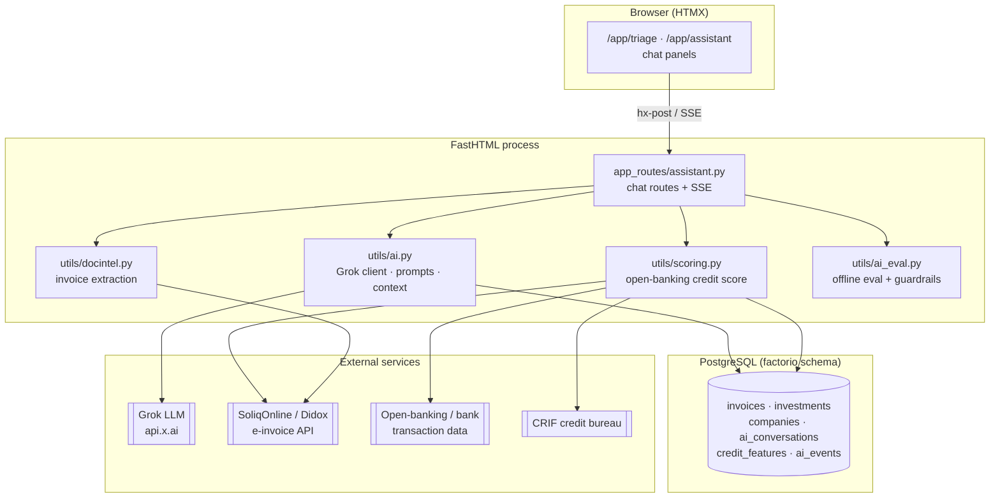
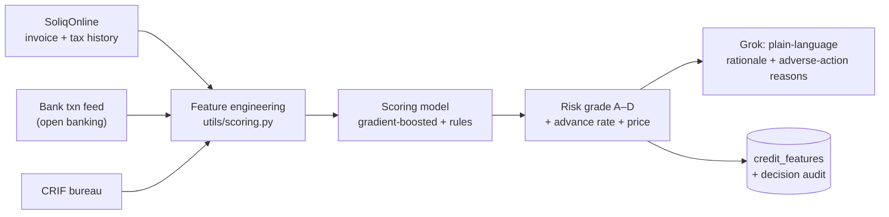

# Factorio — AI Extension Plan

**Prepared by Consistente Ltd for Universalbank**
Extending the Factorio invoice-financing platform with production-grade AI.

This is the engineering companion to `universalbank_consistente_proposal.*`. It
describes concretely how the current FastHTML + PostgreSQL application is extended
with AI, what has already been built as a working prototype, and the phased plan
to production. AI is delivered through **Grok (x.ai)** via its OpenAI-compatible
API, consistent with Consistente's house pattern (versioned prompts, evaluated
agents, auditable output).

---

## 1. What already exists (prototype — built)

The repository now ships a working, dependency-light AI layer:

| Piece | File | What it does |
|---|---|---|
| Config | `utils/config.py` | `XAI_API_KEY`, `XAI_MODEL` (`grok-4.3`), `XAI_BASE_URL`, read through `settings()` |
| AI client | `utils/ai.py` | stdlib `urllib` Grok chat client; graceful degradation; conversation + context builders |
| Triage assistant | `app_routes/assistant.py` → `/app/triage` | chat-based **loan/invoice-application triage** (seller side) |
| Reporting assistant | `app_routes/assistant.py` → `/app/assistant` | chat-based **investor reporting**, grounded in the investor's own positions |
| i18n | `utils/i18n.py` | all assistant copy in en / uz / ru |

Design choices that carry into production:

- **HTMX round-trip transcript.** Each turn posts the full transcript in a hidden
  field; the server appends and re-renders the panel. No session store needed for
  the prototype; trivially swapped for a persisted `ai_conversations` table later.
- **Grounding over generation.** The reporting assistant is given the investor's
  computed metrics + positions as structured context and instructed to answer only
  from that data — the pattern that keeps numbers correct and auditable.
- **Fail-safe.** Any transport/API error returns a short user-safe string; a failed
  AI call never takes down a product page, and the UI disables cleanly when no key
  is set.

---

## 2. Architecture (target)



---

## 3. Phased plan

### Phase 1 — Conversational surfaces (prototype → hardened) · ~2–3 weeks
- **Streaming:** upgrade the two chat routes from request/response to **SSE token
  streaming** (mirrors the sister LiquidRound `/app/chat` pattern). Keep the HTMX
  fallback for no-JS.
- **Persistence:** add `factorio.ai_conversations` + `ai_messages` tables; log
  every turn with `role`, `content`, `model`, `latency_ms`, `token_usage`.
- **Tool calls:** give the triage assistant function-calling tools —
  `lookup_debtor(company)`, `get_soliq_invoice(number)`, `indicative_terms(grade,
  amount, tenor)` — so it fills gaps from real data instead of asking the seller.
- **Guardrails:** PII redaction on logs, prompt-injection filter on user input,
  max-token + rate limits per investor.

### Phase 2 — Open-banking-style credit scoring · ~4–6 weeks
The differentiator vs. OzPlanet. A `utils/scoring.py` pipeline that fuses:
- **SoliqOnline / Didox** — verified invoice history, buyer-confirmation record,
  tax-declared turnover (the Uzbek analogue of a Plaid transaction feed).
- **Open-banking / bank account** transaction cash-flow signals (inflow stability,
  balance volatility, overdraft frequency).
- **CRIF bureau** — existing obligations and defaults.


- Model produces the **grade, advance rate and price**; Grok produces the
  **human-readable rationale and adverse-action reasons** (auditable, not the
  decision-maker). Every decision is versioned and reproducible — Consistente's
  core methodology.

### Phase 3 — Document intelligence · ~3–4 weeks
- `utils/docintel.py`: extract structured fields from uploaded/attached invoices
  and contracts (amount, parties, dates, line items) with **citation trails** back
  to the source document; cross-check against the SoliqOnline record to flag
  mismatches. Reduces manual credit-officer review to exceptions only.

### Phase 4 — Proactive reporting & agentic workflows · ~3–4 weeks
- **Investor report generation:** scheduled job composes a monthly portfolio
  narrative (returns, concentration, upcoming settlements) from the same grounding
  context, delivered by email and as a chat summary.
- **Auto-invest copilot:** natural-language strategy ("fund A/B-grade logistics
  invoices under UZS 300M, max 15% per debtor") compiled into the existing
  `auto_invest` rules, with an AI explanation of matches.
- **Collections triage:** rank at-risk positions and draft debtor follow-ups.

### Phase 5 — Evaluation, observability, cost control · ongoing
- `utils/ai_eval.py`: golden-set regression tests for triage and reporting;
  factual-grounding checks (does every number in an answer trace to the context?).
- Dashboards for latency, token spend, and answer-grounding rate.
- Model routing: cheap model for classification/extraction, `grok-4.3` for
  reasoning.

---

## 4. Data model additions

```sql
-- conversation persistence
factorio.ai_conversations(id, user_id, kind, created_at)
factorio.ai_messages(id, conversation_id, role, content, model, tokens, latency_ms, created_at)
-- scoring
factorio.credit_features(company_id, feature_json, source, computed_at)
factorio.credit_decisions(invoice_id, grade, advance_rate, price_bps, rationale, model_version, created_at)
-- observability
factorio.ai_events(id, kind, meta_json, created_at)
```

## 5. Dependencies & ops
- No heavy dependency added for the prototype (stdlib client). Production streaming
  can adopt the `openai` SDK pointed at `XAI_BASE_URL`.
- Secrets via env/`settings()` only; `XAI_API_KEY` never logged.
- Deploys unchanged (Docker on Coolify); AI is one more env-configured capability.

## 6. Risks & mitigations
- **Hallucinated numbers →** strict grounding + eval grounding-rate gate.
- **Prompt injection →** input filtering, tool allow-list, no secret in prompt.
- **Model/vendor lock-in →** OpenAI-compatible interface; model id is config.
- **Regulatory (automated decisions) →** model scores, human approves; full audit
  trail per decision.
