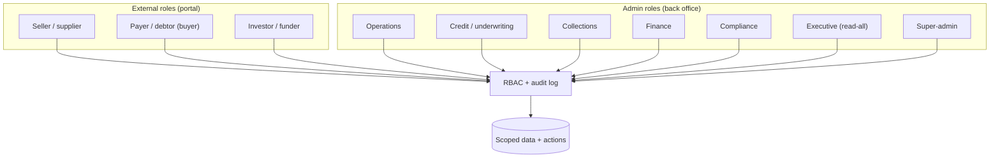
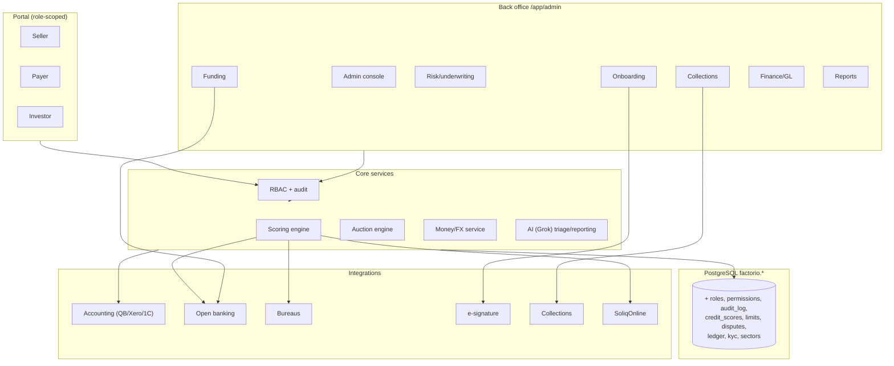

# Factorio — Enterprise Extension Plan

**Prepared by Consistente Ltd.** Roadmap to take Factorio from an investor-facing
marketplace demo to an **enterprise-grade, multi-currency invoice-finance /
factoring / supply-chain-finance platform** with a full back office, role-based
access control, and bank-white-label deployment.

This plan draws on three inputs: the back-office capability brief, the incumbent
Investly product (three decks in `data/`), and the existing Factorio schema
(`db/schema.sql`), which already mirrors much of the model.

---

## 1. Vision & positioning

A single platform serving **four distinct user constituencies** over one asset —
the receivable — with a bank or fund providing capital:

- **Seller / supplier (client)** — sells or discounts invoices for liquidity.
- **Payer / debtor (buyer)** — owes the invoice; confirms and pays; can run
  reverse-factoring (supply-chain-finance) programmes for its suppliers.
- **Investor / funder** — funds invoices for asset-backed return (retail,
  institutional, or an SPV — see `universalbank_consistente_proposal`).
- **Admin (internal)** — operations, credit, collections, finance, compliance,
  executive — runs the back office.

Product lines on shared infrastructure (Investly ran two; we generalise to four):
**factoring** (recourse / non-recourse), **invoice discounting** (confidential),
**reverse factoring / SCF** (buyer-led), and **refinancing / forfaiting**
(cross-border, longer-tenor). Pricing engine supports both **fixed-rate** and
**reverse-auction** (Investly's moat: investors bid the rate down).

---

## 2. Roles & RBAC (the demo focus)

### 2.1 Role model

### 2.2 Permissions matrix (illustrative)

| Capability | Seller | Payer | Investor | Ops | Credit | Collections | Finance | Compliance | Exec | Super |
|---|---|---|---|---|---|---|---|---|---|---|
| Submit / view own invoices | ✎ | 👁 (as debtor) | — | 👁 | 👁 | 👁 | 👁 | 👁 | 👁 | ✎ |
| Confirm/dispute invoice (debtor) | — | ✎ | — | 👁 | 👁 | ✎ | — | 👁 | 👁 | ✎ |
| Browse marketplace / fund | — | — | ✎ | 👁 | 👁 | — | 👁 | 👁 | 👁 | ✎ |
| KYC / onboarding review | — | — | — | ✎ | 👁 | — | — | ✎ | 👁 | ✎ |
| Credit score / set limits | — | — | — | — | ✎ | — | — | 👁 | 👁 | ✎ |
| **Approve funding / release advance** | — | — | — | — | 👁 | — | ✎ | 👁 | 👁 | ✎ |
| Run collections / dunning | — | — | — | 👁 | 👁 | ✎ | 👁 | 👁 | 👁 | ✎ |
| Write-off / provision | — | — | — | — | 👁 | 👁 | ✎ | ✎ | 👁 | ✎ |
| GL / reconciliation | — | — | — | — | — | — | ✎ | 👁 | 👁 | ✎ |
| Reports / audit log | own | own | own | 👁 | 👁 | 👁 | 👁 | ✎ | 👁 | ✎ |
| User & role management | — | — | — | — | — | — | — | 👁 | 👁 | ✎ |

✎ act · 👁 view · — no access.

### 2.3 Segregation of duties (SoD)
The matrix enforces the classic control: **the role that underwrites (Credit)
cannot release funds (Finance)**, and Compliance owns KYC + audit independently.
Every state-changing action is written to an **immutable audit log**
(`who · role · action · entity · before/after · timestamp`).

### 2.4 Auth roadmap
- **Phase 0 (this demo):** role + identity switcher (no password), role-scoped
  nav and views, audit log — enough to walk a bank through every persona.
- **Phase 1:** real accounts — email/password, sessions, bcrypt, per-user role
  assignment, invite flow.
- **Phase 2:** **SSO (OIDC/SAML)** for bank staff, **MFA**, access reviews,
  session management, IP allow-lists.

---

## 3. Back-office functional modules

Mapped from the capability brief; each is a module under `/app/admin/*` with
its own data and RBAC. Investly features noted where they apply.

### 3.1 Client & debtor onboarding / management
KYC/AML (client + debtor), creditworthiness assessment, client agreements,
**facility limits** (advance rates 70–90%), **debtor ledger**, **concentration
limits**, **approved-buyer lists**. *Investly:* due-diligence + Amadeus BvD
company data + investor accreditation/verification.

### 3.2 Invoice processing & verification
Upload/validation (API + accounting integrations — QuickBooks, Xero, 1C),
authenticity checks, PO/contract matching, **assignment/pledging** (notified or
confidential), **holdback/reserve** calculation. *Uzbekistan:* SoliqOnline
verification (see AI plan). *Investly:* digital signature (SignWise-style).

### 3.3 Funding & disbursements
Advance calculation & payout (same/next-day), **reserve release** on debtor
payment, fee/interest reconciliation, late fees, **multi-currency & cross-border**
(export factoring / forfaiting). *Investly:* investor wallet, deposits/withdrawals,
direct debit, internal payment ledger.

### 3.4 Collections & credit management
Automated reminders / **dunning**, collections workflow, dispute resolution,
**bad-debt provisioning & write-offs** (recourse / non-recourse), credit-insurance
integration. *Investly:* Creditreform-style automated collections partner.

### 3.5 Risk management & underwriting
Real-time **scoring** (multi-signal), portfolio risk monitoring, **fraud
detection** (duplicate invoices), aging & **dilution** tracking, **exposure limits**
per client/debtor/sector. *Investly's differentiator:* score **both applicant and
debtor** before auction; **model back-testing — actual vs expected default rate**.

### 3.6 Accounting & financial operations
Ledger entries (purchases, advances, fees, interest), bank reconciliation, cash
management, **regulatory reporting** (capital adequacy if bank-regulated),
VAT/tax on factored invoices.

### 3.7 Reporting & analytics
Dashboards: portfolio performance, **DSO**, recovery rates, dilution;
**funder/investor reports** (incl. securitisation/SPV); compliance & audit trails.
*Investly KPIs:* funnel conversion, time-per-application (incl. admin time),
default-rate accuracy, CAC/LTV by channel.

### 3.8 Compliance, legal & audit
GDPR, AML, consumer-credit adherence; contract management; assignment
registration (**UCC (US) / CBU collateral registry (UZ)** / equivalent); audit
support; data retention.

---

## 4. Enterprise features (from Investly + market)

| Feature | Status in repo | Plan |
|---|---|---|
| Reverse-auction pricing engine | — | Bidding engine; investors bid rate + amount; lowest wins |
| Autobidder / auto-invest rules | `auto_invest` table | Build rule engine + matching on new invoices |
| Secondary market | `secondary_market` table | Position trading + 1% fee |
| Multi-signal credit scoring + back-testing | — | Scoring engine (SoliqOnline + bank + bureau) + actual-vs-expected |
| Investor accreditation/verification | partial | KYC + accredited-investor gating |
| Digital signature | — | e-sign integration for contracts/assignments |
| Collections partner integration | — | Dunning + external collections handoff |
| Accounting / bank API integrations | — | QuickBooks/Xero/1C + open banking |
| Multi-currency / multi-country | partial (marketplace map) | Central money service, FX, per-region entities |
| SPV / securitisation reporting | proposal-level | Investor/funder reporting for SPV (DIFC) |
| API-first (institutional) | — | Public API + webhooks |
| Gamification (investor engagement) | — | Leaderboards/badges (optional) |

---

## 5. Sectors & multi-currency

- **Sectors** become a first-class dimension (home-page dropdown + per-sector
  landing use cases + risk/concentration analytics): Hospitality, Construction,
  Retail, Manufacturing, Wholesale, Logistics & Transport, Healthcare,
  Professional Services, Agriculture, Energy.
- **Multi-currency:** the home page speaks generically of *multi-currency* (no
  hardcoded UZS). A single money service formats and converts EUR/USD/GBP/UZS/…
  with per-facility base currency; FX handling for cross-border factoring.

## 6. Internationalisation

Five languages: **English, Oʻzbekcha, Russian, Spanish, French** — the whole app,
not just the landing site. `t(key, lang)` with a full key set per language and an
English fallback. Adding a language = adding a column, no route changes.

---

## 7. Architecture additions

### Data-model additions (new tables)
`roles`, `user_roles`, `permissions`, `audit_log`, `kyc_cases`,
`facility_limits`, `credit_scores`, `disputes`, `ledger_entries`,
`collections_actions`, `sectors`, `bids` (auction), `fx_rates`.

---

## 8. Phased roadmap

| Phase | Theme | Highlights |
|---|---|---|
| **0 — Demo (this pass)** | RBAC + admin console + i18n×5 + sectors + multi-currency | Role switcher, `/app/admin` with onboarding / risk / funding / collections / reports (demo data), audit log; ES/FR added; UZS off home page |
| **1 — MVP back office** | Real ops | Real auth, KYC workflow, facility limits, invoice verification + assignment, funding approval with SoD, dunning |
| **2 — Risk & money** | Underwriting + GL | Scoring engine + back-testing, fraud checks, ledger/reconciliation, multi-currency/FX |
| **3 — Marketplace depth** | Investly parity | Reverse-auction engine, autobidder, secondary market, investor accreditation |
| **4 — Enterprise & integrations** | Scale | SSO/MFA, accounting + bank-API + bureau + e-sign + collections integrations, public API, SPV reporting |

---

## 9. What ships in this demo pass
- **RBAC demo:** identity/role switcher across seller / payer / investor / admin
  (+ admin sub-roles); role-scoped navigation; **audit log** of actions.
- **Admin console** `/app/admin` with the four prioritised areas as working,
  data-driven demo screens: **onboarding & limits**, **risk & underwriting**,
  **funding & collections**, **reports**.
- **Sectors:** expanded set + home-page dropdown with per-sector use cases.
- **Multi-currency:** home page de-UZS'd to "multi-currency".
- **i18n:** Spanish + French added across the app.

See commit history and `docs/ai_extension_plan.md` for the AI layer that plugs
into risk (scoring rationale) and reporting (chat).
