

Invoice financing, end to end

<h1>Factorio — User Guide</h1>

Live at <strong>factorio.co.uk</strong> · hello@factorio.co.uk

Factorio is an invoice-financing (factoring) marketplace. Businesses sell their
unpaid invoices for cash today; investors fund those invoices for a short-term,
asset-backed return; the back office runs the credit, funding and collections
behind it.

This guide is organised by **who you are**. It is split into four clearly
separated parts — one per persona. Jump to the part that matches your role; each
starts on its own page with a coloured separator.

| Part | Persona | Sign in as | What you do |
|---|---|---|---|
| **1** | **Investor** | Investor | Fund verified invoices; track a portfolio of short-term, asset-backed returns |
| **2** | **Supplier** | Supplier | Sell / discount unpaid invoices for cash in 24–48 hours |
| **3** | **Payer** | Payer | Confirm invoices you owe; run supplier early-payment programmes |
| **4** | **Admin** | Admin | Operate the factoring business — onboarding, risk, funding, collections, compliance |

Every signed-in view is the same **cockpit**: a left rail with two sections —
**Agents** (the **Copilot** chat, which opens in the centre) and **Tools** (your
screens). The Copilot answers questions grounded in live data; the Tools list is
**role-scoped**, so you only ever see what belongs to your role. There are four
roles — Investor, Supplier, Payer and Admin — switchable from the top bar.

Part 1 of 4 · Sign in as “Investor”

<h1>Investor</h1>

Put capital into verified invoices for short-term, asset-backed returns.

**For investors / funders.** The app opens on the **Copilot** — a central AI chat
(the Agents view) — with your Tools in the left rail. Amounts are shown in USD
(multi-currency supported).

## Copilot (Agents)
The landing view: a central chat that answers questions grounded in **your own
live positions** — net return, exposure by sector or debtor, overdue positions,
upcoming settlements. Suggestion cards sit at the bottom to get you started.

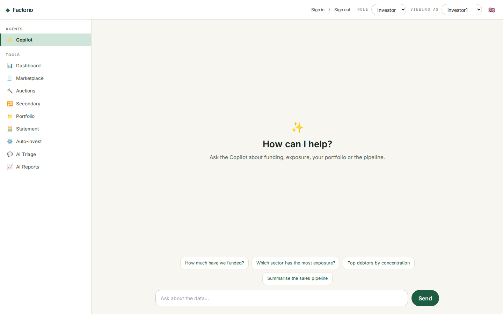

## Dashboard
Your personalised overview: **portfolio value, net annual return, earned to date
and the next settlement**, a recent-activity feed, and quick actions.

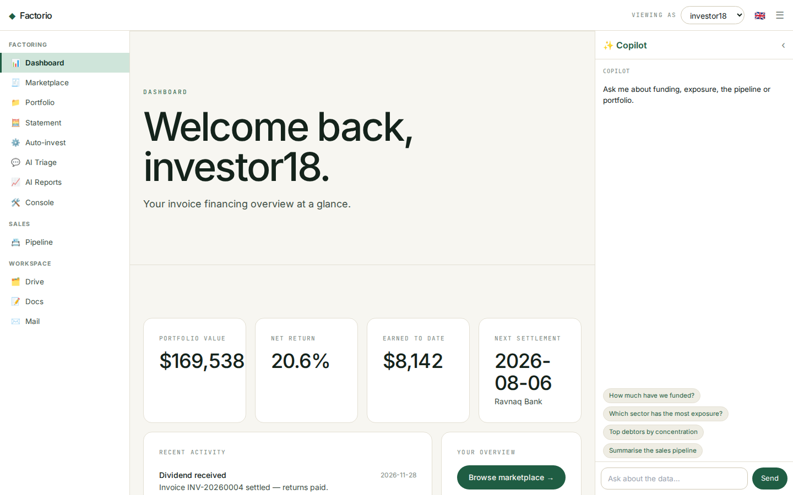

## Marketplace
Every open, fundable invoice as a card — debtor, sector, risk grade (A–D), amount
and a live funding-progress bar — with advance rate, fee and estimated return.
Filter by sector, grade, term and minimum return.

## Invoice detail
Full transparency before funding: the funding panel (raised vs goal, advance, fee,
estimated return) and a **debtor-company profile** (registration, sector, country,
turnover).

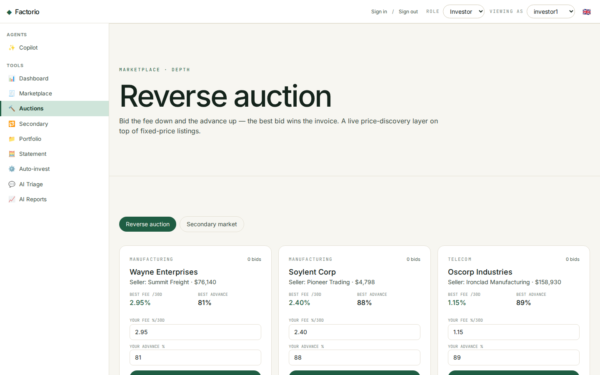

## Portfolio
The reporting cockpit: **net annual return** and **account value** panels, an
**aging table** (days to / past due), a **payment-habits table** (how settled
invoices actually paid), and a positions table.

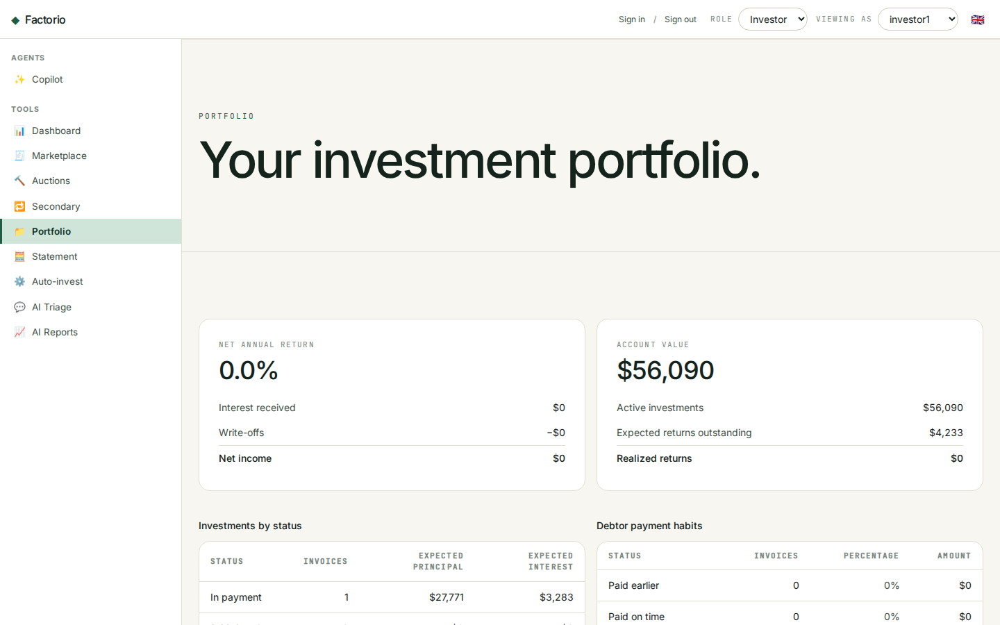

## Statement
A unified ledger of cash movements — investments out (−) and settlements in (+) —
filterable by date, type, counterparty and amount, with CSV export.

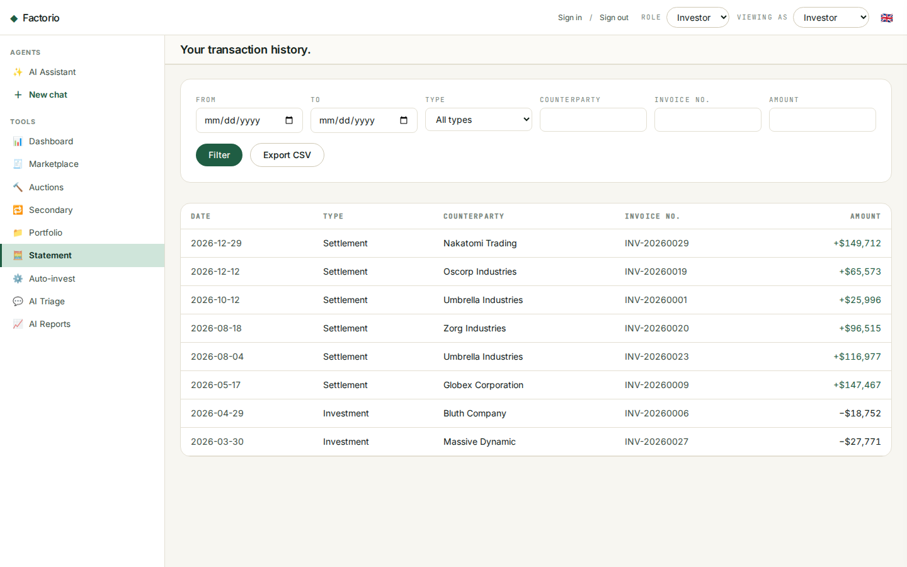

## Auto-invest
Rule-based automated bidding: minimum risk grade, maximum amount per invoice and
preferred sectors — applied to matching new invoices.

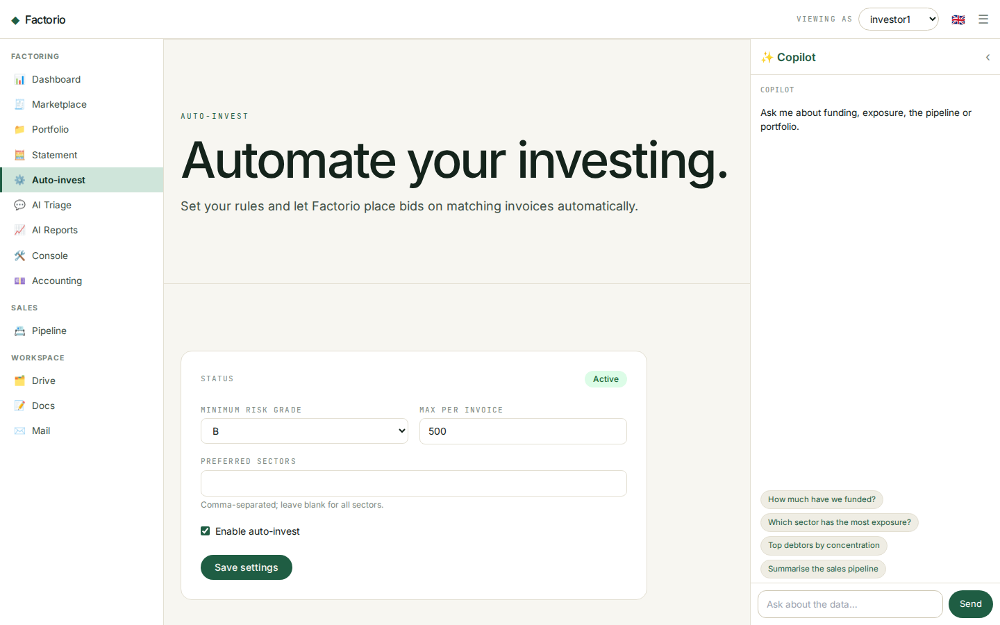

## AI reports (copilot)
Ask questions grounded in your own live positions — net return, exposure by sector
or debtor, overdue positions, upcoming settlements. The copilot answers from real
data, never invented figures.

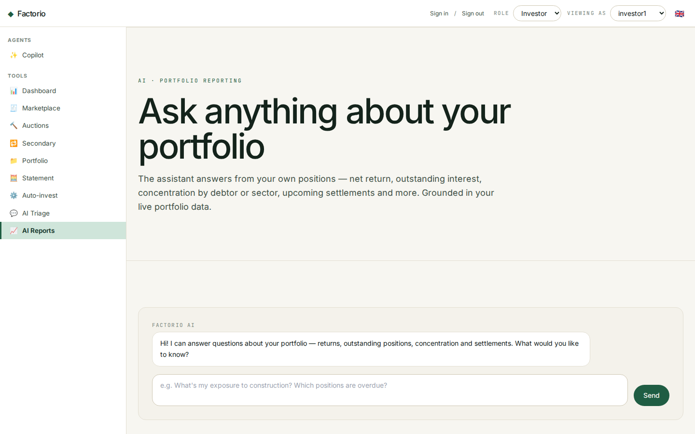

Part 2 of 4 · Sign in as “Supplier”

<h1>Supplier</h1>

Sell or discount your unpaid invoices for cash today instead of waiting 30–90 days.

**For suppliers / clients.** Factoring, not a loan — no new debt on your balance
sheet; funding scales with your sales. Sign in with the **Supplier** role.

## My applications
Your submitted invoices with debtor, amount, risk grade and status
(submitted → verified → funding → funded → settled). Track each from submission to
advance.

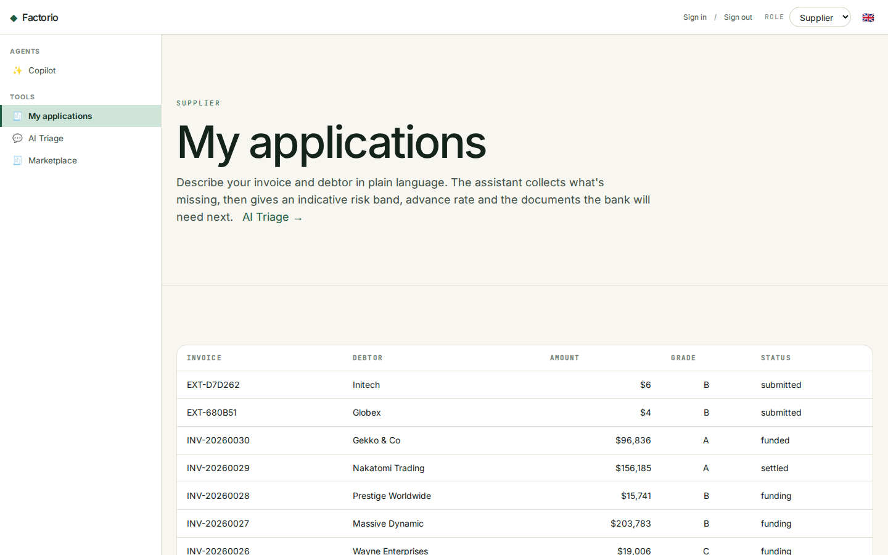

## AI triage — get an indicative offer in a chat
Describe an invoice and debtor in plain language; the assistant collects only
what's missing, then returns an **indicative risk band (A–D)**, an **advance rate**
and the **documents the bank needs next** — in seconds, in your language.
Everything is indicative, subject to verification.

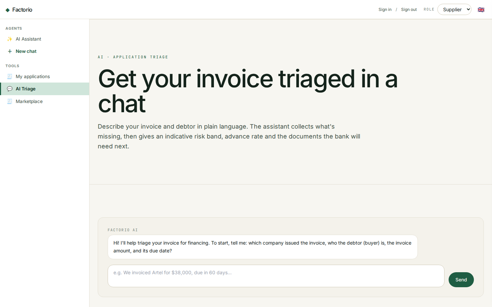

## The supplier journey
1. **Sign up** (bank KYC).
2. **Submit / import** an invoice (SoliqOnline-verified, buyer-confirmed).
3. **Triage** in chat → indicative terms.
4. **Approval** by the bank (one click) → collateral registered.
5. **Advance** in your account in 24–48 hours; the reserve is released when the
   debtor pays.

Part 3 of 4 · Sign in as “Payer”

<h1>Payer</h1>

Confirm the invoices you owe so your suppliers can be financed — and pay your network early without breaking your terms.

**For payers / debtors** — the buyers who owe the invoices. The payer anchors the
credit in factoring: a specific, buyer-confirmed obligation. Sign in with the
**Payer** role.

## Invoices to confirm
The invoices where you are named as the debtor, with amount, due date and status.
**Confirm** the obligation (or dispute it) — confirmation is what lets the supplier
draw an advance; on the SoliqOnline rails this confirmation is on official record.

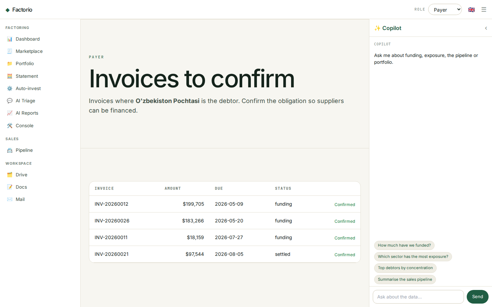

## Reverse factoring (supply-chain finance)
As a large buyer you can run a **reverse-factoring programme**: approve early
payment for hundreds of suppliers at once. Suppliers get paid early; you keep your
payment terms; the platform (funded by the bank, investors or an SPV) bridges the
gap.

Part 4 of 4 · Sign in as “Admin”

<h1>Admin — Back Office</h1>

Operate the factoring business: onboarding, risk, funding, collections, accounting and compliance — under role-based access control with full audit logging.

**For internal back-office users.** Reached from the **Console** tool (or
`/app/admin`). Admin is a single **full-access** role — it sees every Tool in the
left rail (onboarding, processing, risk, credit scoring, funding, collections,
accounting, compliance, integrations, reports, audit — plus the Sales pipeline
and Workspace) and the **Copilot** for data questions. Every state-changing
action is written to the audit log. The **Role** switcher (top-right) moves
between the four roles.

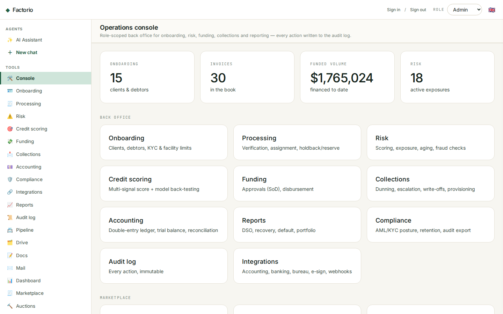

## 1 · Client & debtor onboarding / management
**Screen: Onboarding.** KYC/AML status per client and debtor, sector, country,
annual turnover, and a derived **facility limit** (advance rates 70–90%). Admin sets the facility limit; the value is derived from turnover and grade.

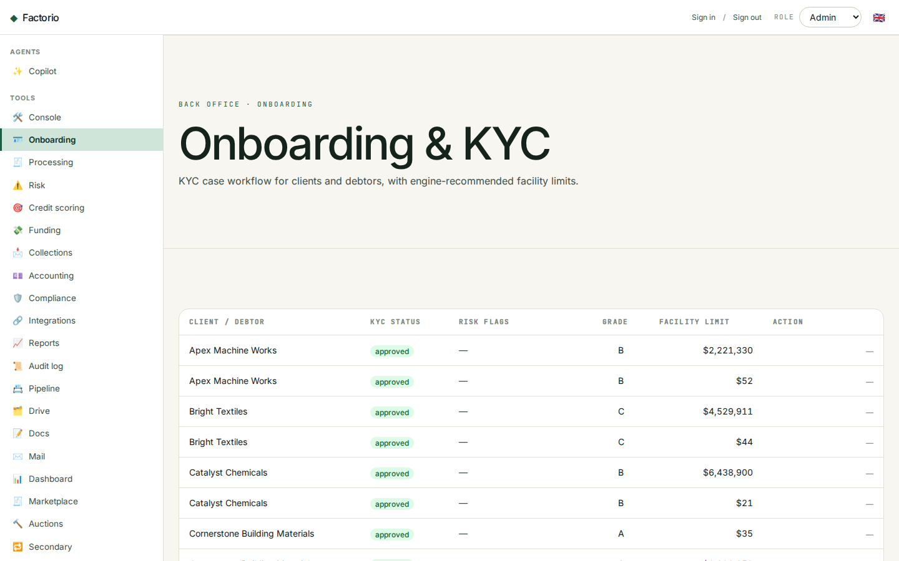

## 2 · Invoice processing & verification
Invoices arrive verified against SoliqOnline (buyer-confirmed), assigned, and
risk-graded. The pipeline and detail views show amount, advance rate, grade and
status; holdback/reserve is the difference between face value and advance.

## 3 · Funding & disbursements
**Screen: Funding.** The funding pipeline lists verified/funding invoices with
amount, grade, computed advance and status. **Approve & release** disburses the advance; every approval is written to the audit log.

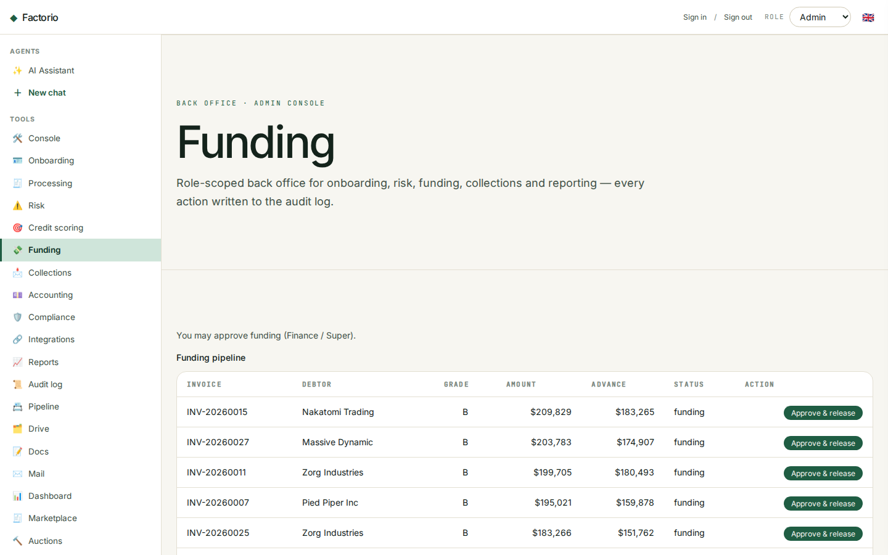

## 4 · Collections & credit management
Same screen: an **overdue / collections** table with a dunning stage per invoice.
Reminders escalate; disputes and write-offs (with bad-debt provisioning) are
handled here.

## 5 · Risk management & underwriting
**Screen: Risk.** Risk-grade distribution (A–D), **exposure by sector**, **debtor
concentration**, and a **duplicate-invoice fraud check**.

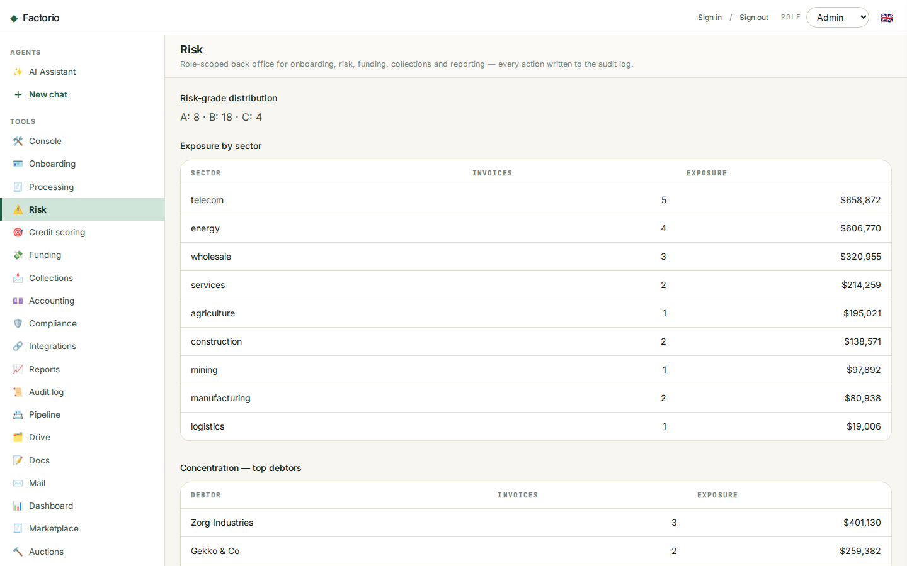

**Screen: Credit scoring (production).** A multi-signal debtor score fusing
observed payment/default history, concentration and sector risk with credit-bureau
and open-banking cash-flow signals. It produces a **score (0–100), grade (A–D),
indicative advance rate and price**, plus plain-language **adverse-action reasons**.
The model sets the numbers; a human approves.

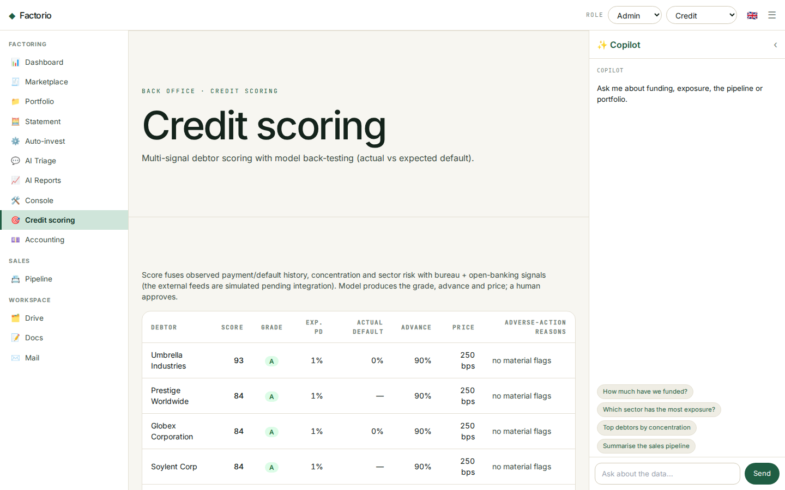

**Model back-testing.** The differentiator: **actual vs expected default rate** per
grade — the model-accuracy metric — so calibration drift is visible and the model
can be re-tuned.

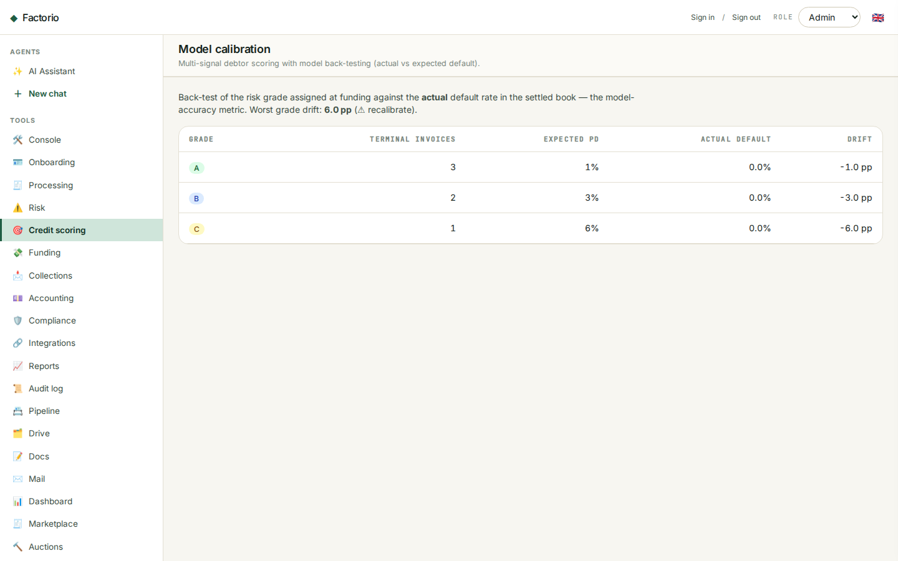

## 6 · Accounting & financial operations
**Screen: Accounting.** A **production double-entry general ledger**, derived
deterministically from the factoring events (advances, settlements, fees,
write-offs) so it always ties out. Includes a **trial balance**, a **journal**,
per-account **ledger drill-down**, and **bank reconciliation** (matched vs unmatched).

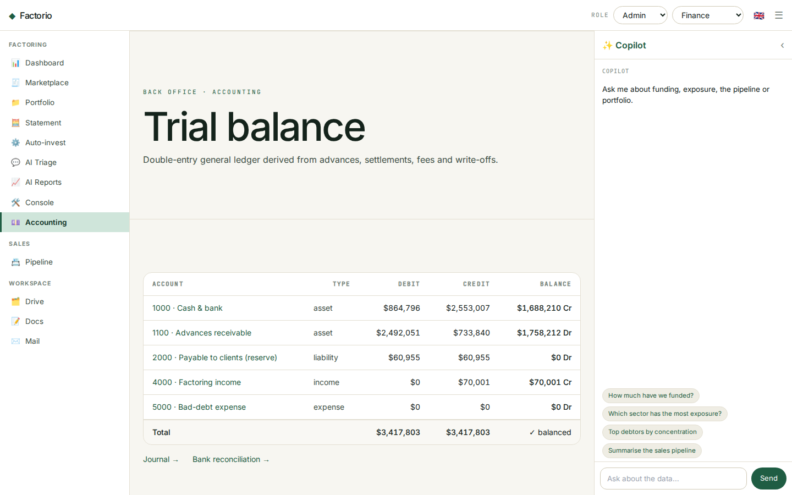
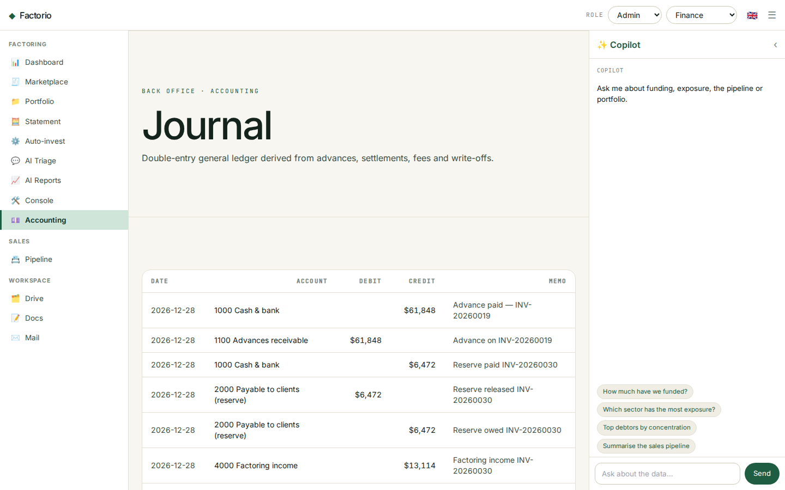
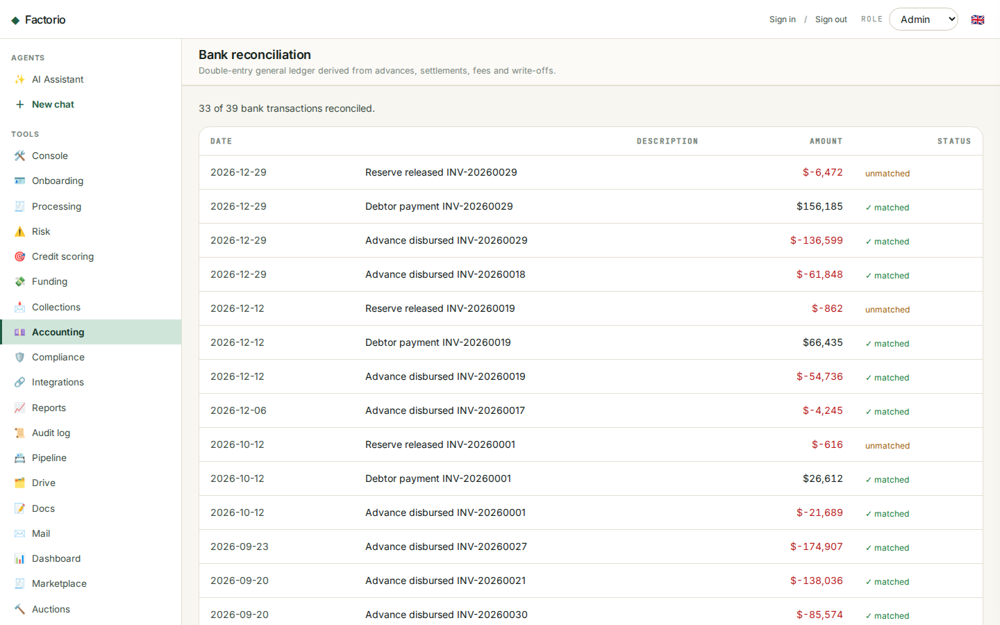

## 7 · Reporting & analytics
Reporting KPIs (DSO, default rate, funded volume by sector) plus the **copilot**:
ask "which sector has the most exposure?", "top debtors", "summarise the pipeline"
and get grounded, real-number answers.

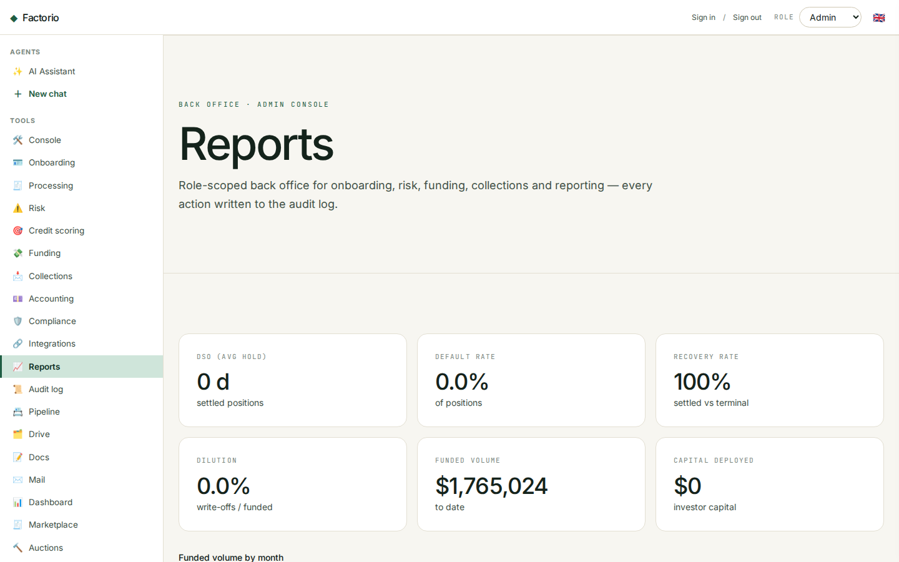

## 8 · Compliance, legal & audit
**Screen: Audit log.** Every state-changing action — who (actor + role), what
action, which entity, when — is recorded immutably. This underpins SoD, regulatory
reporting and dispute evidence.

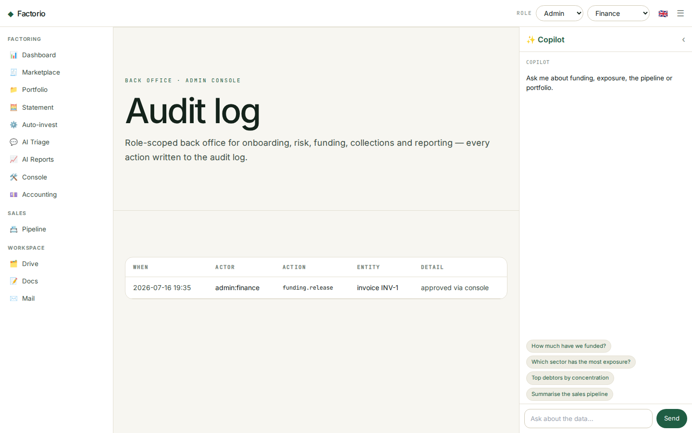

## Workspace modules (back-office tooling)

**Sales pipeline (CRM).** A kanban pipeline for back-office sales — deals by stage
(Qualification → Demo → Proposal → Negotiation → Ready to close), value and owner.

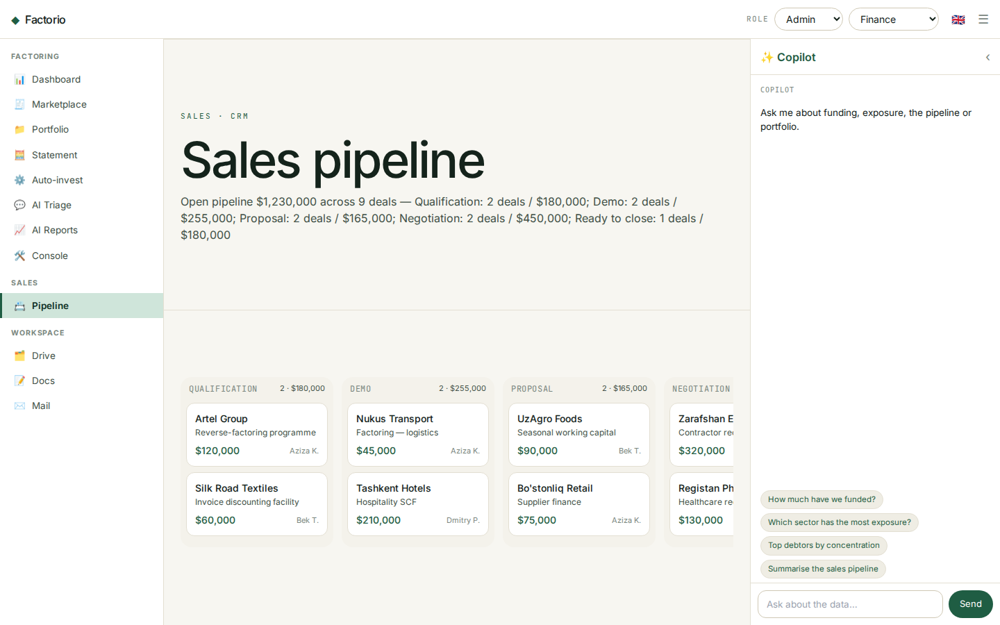

**Drive · Docs · Mail.**

- **Drive** — invoice, KYC and collateral documents (folders, sharing, links).
- **Docs** — policies, playbooks and term sheets (block editor, versions).
- **Mail** — client, debtor and bureau correspondence (threads, AI draft replies).

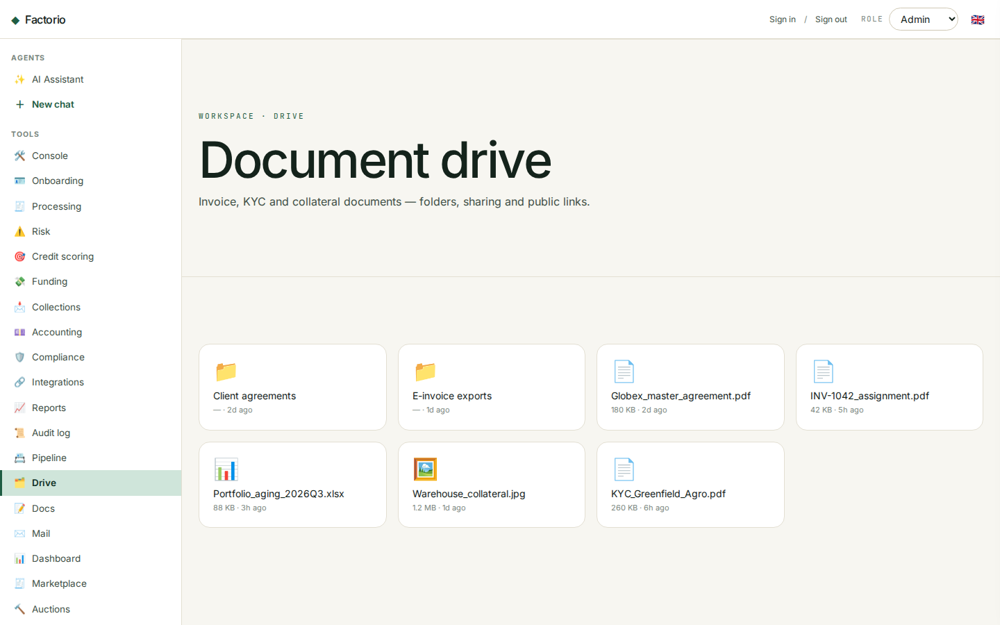
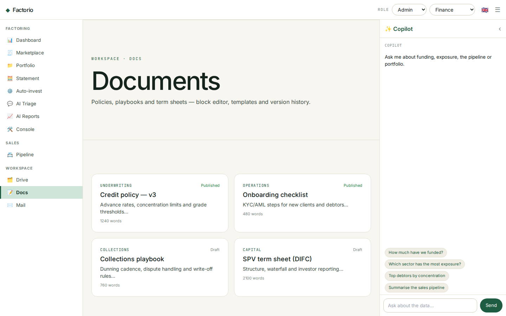
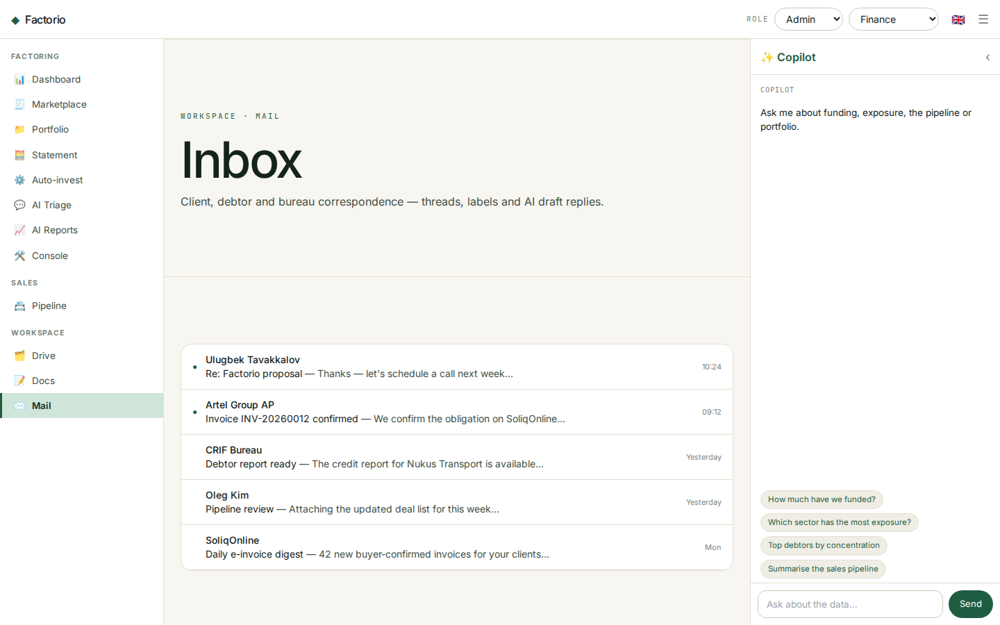

## Roles & access (summary)
Four roles, switchable from the top bar. Tools are role-scoped; Admin has full
back-office access, and every privileged action is captured in the audit log.

| Role | Sees |
|---|---|
| **Investor** | Copilot · Dashboard · Marketplace · Auctions · Secondary · Portfolio · Statement · Auto-invest · AI Triage · AI Reports |
| **Supplier** | Copilot · My applications · AI Triage · Marketplace |
| **Payer** | Copilot · Invoices to confirm |
| **Admin** | Copilot · the full back office + Sales pipeline + Workspace |

---

*Factorio · live at factorio.co.uk · hello@factorio.co.uk*
