# Factorio — User Guide
## Invoice financing, end to end

Generated 2026-06-28 · Live at **factorio.co.uk**

Factorio is an invoice-financing (factoring) marketplace. Businesses sell their unpaid invoices for cash today; investors fund those invoices for a short-term, asset-backed return. This guide walks through every screen — the public site and the investor product app — one screen per slide.

---

Overview

## What Factorio is

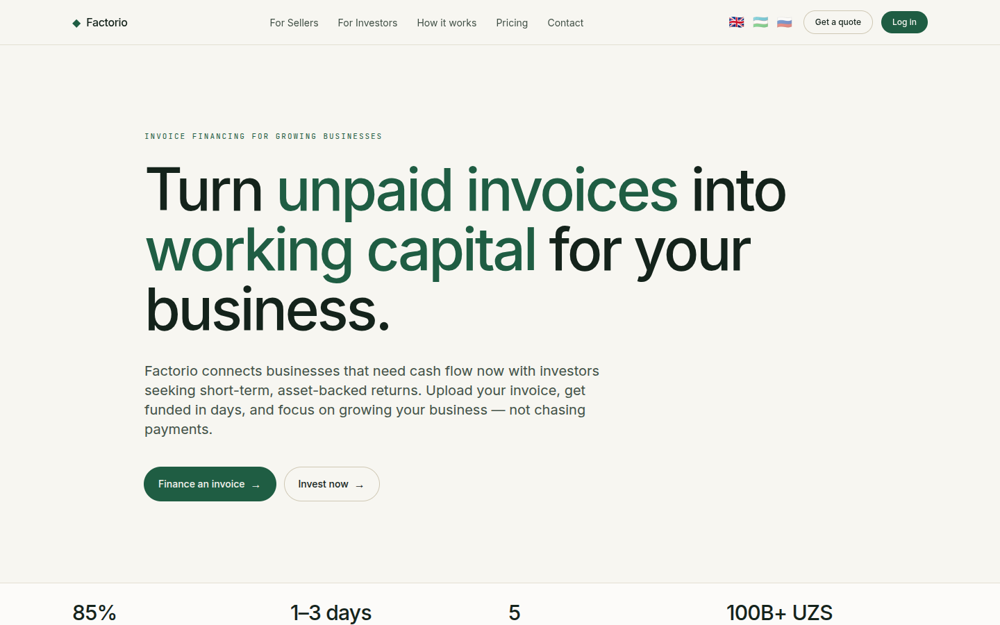

- An invoice-financing marketplace connecting two sides: **sellers** who need cash now and **investors** seeking short-term, asset-backed returns.
- One site serves both — a marketing front and an HTMX-driven product app.
- The hero summarizes the model: advance rate, days-to-funding, sectors served and total funded volume (UZS).
- Fully trilingual — English, Oʻzbekcha and Russian — switched from the top navigation.

---

For sellers

## Turn invoices into working capital

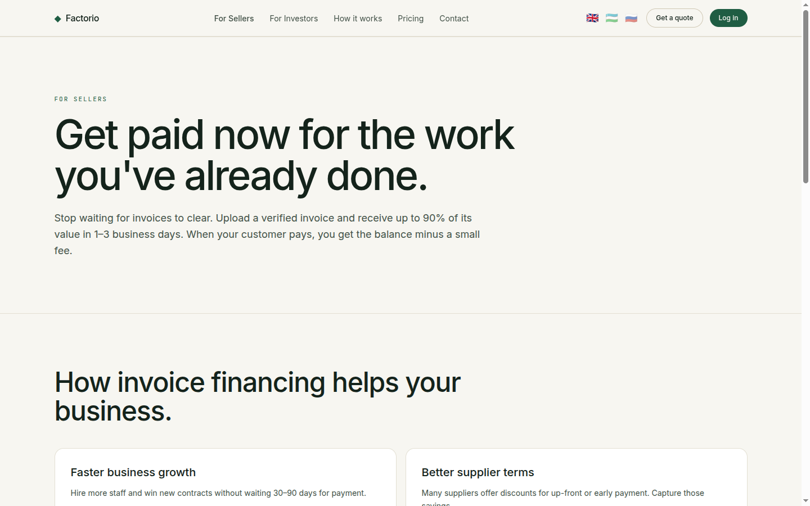

- Get a large share of an invoice advanced in days instead of waiting 30–120 days for the debtor to pay.
- The seller journey: submit an invoice → get it verified and risk-graded → receive the advance → settle when the debtor pays.
- Factoring, not a loan — no new debt on the balance sheet; funding scales with sales.
- Built for manufacturing, wholesale, construction, logistics and services.

---

For investors

## Short-term, asset-backed returns

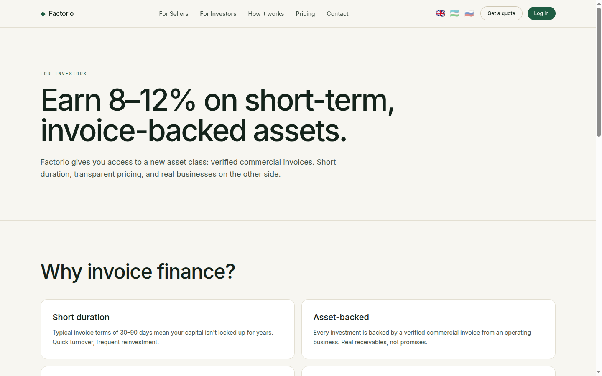

- Fund verified invoices and earn a fee/return over a short hold — often just weeks.
- Diversify across debtors, sectors and risk grades (A–D).
- Returns are tied to real receivables, not market speculation.
- Leads into the investor app — dashboard, marketplace and portfolio.

---

How it works

## Four steps, end to end

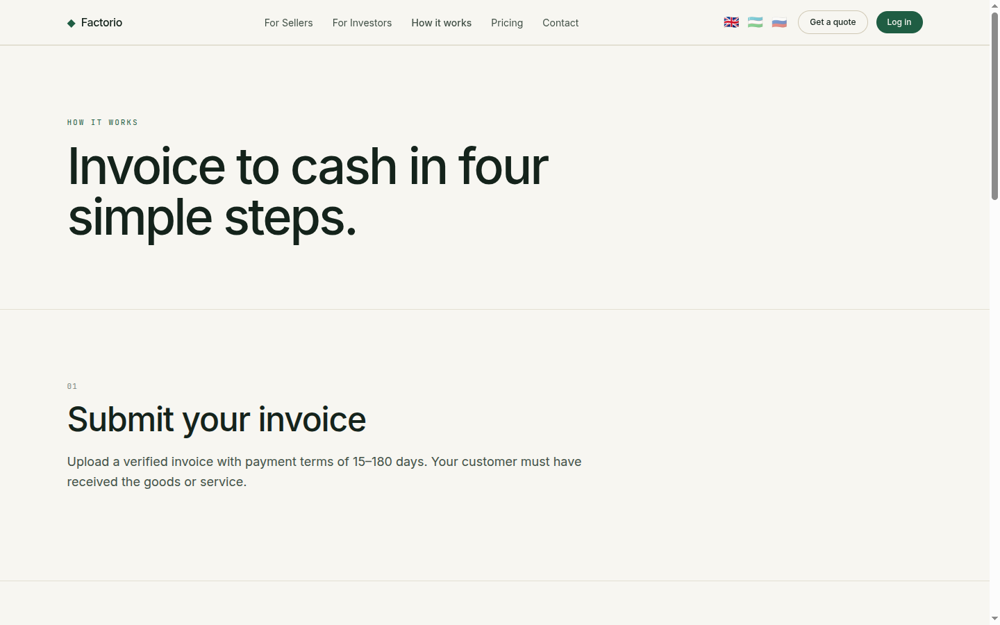

- **Submit** — a seller uploads an invoice and company details.
- **Verify** — Factorio checks the debtor and assigns a risk grade and pricing.
- **Fund** — the invoice appears on the marketplace; investors fund it to its goal.
- **Settle** — when the debtor pays, principal + interest are distributed and the position closes.

---

Pricing

## Transparent, per-invoice fees

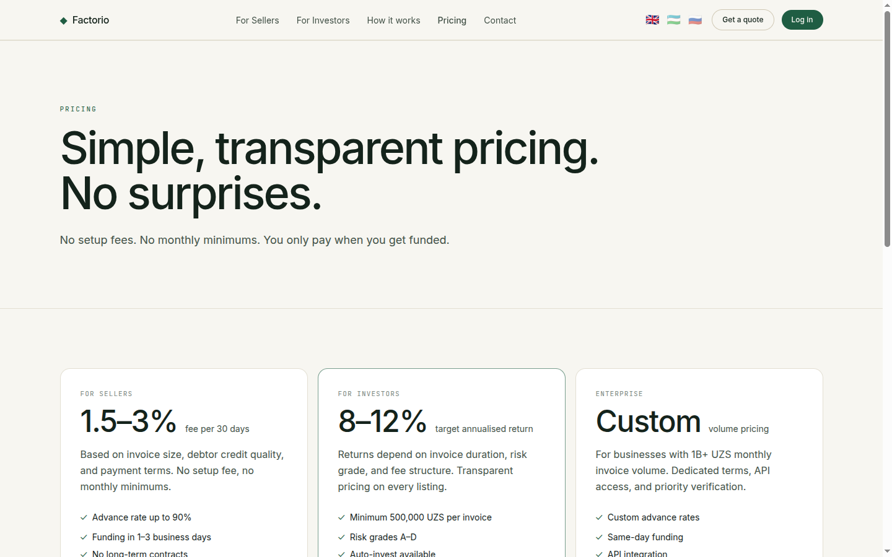

- Pricing is per invoice — a fee per 30 days against the advanced amount, with no hidden charges.
- Shows the headline advance rate and worked example economics.
- No subscription and no commitment to submit an invoice.
- A clear breakdown so both sides understand the return and the cost.

---

Contact

## Get in touch

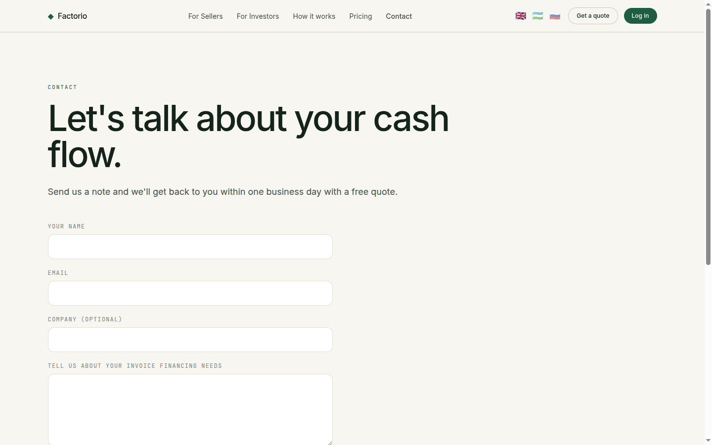

- A contact page for sellers and investors to reach the Factorio team.
- Shows the contact email and a simple enquiry form.
- The entry point to start onboarding.

---

Investor app · Dashboard

## Your personalized overview

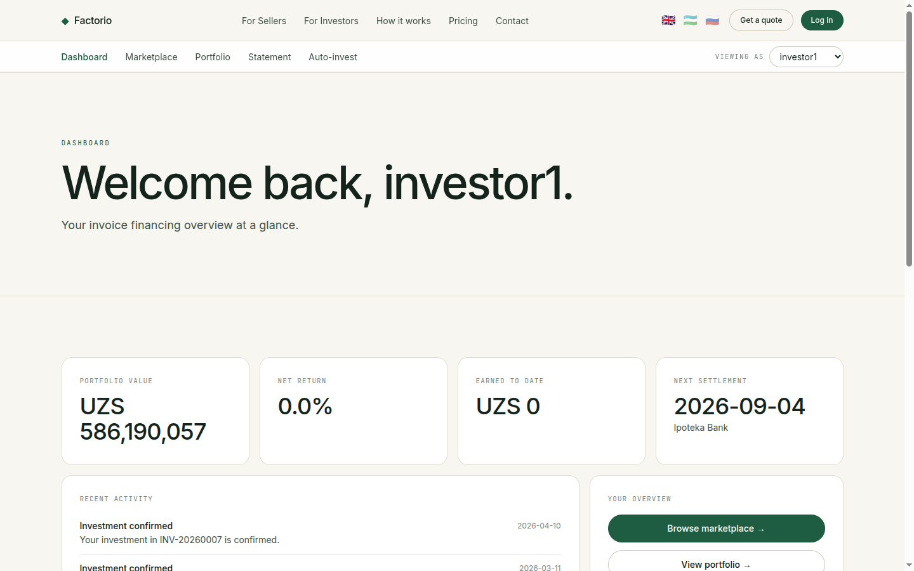

- The `/app` home greets the current investor and leads with their own KPIs: portfolio value, net annual return, earned-to-date and the next settlement.
- A recent-activity feed surfaces notifications — fundings, settlements and updates.
- Quick actions jump to the marketplace, portfolio and statement.
- Platform-wide stats are kept as a secondary strip.
- Top-right **investor switcher** lets you view the app as any investor (demo, no password).

---

Investor app · Marketplace

## Browse fundable invoices

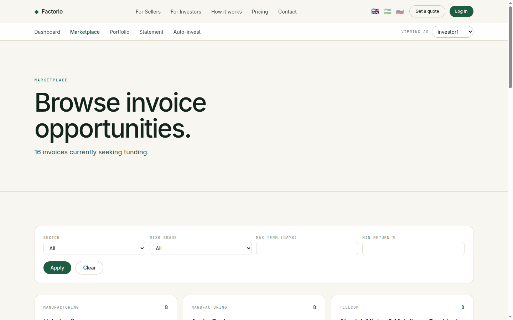

- Every open, fundable invoice is a card: debtor, sector, risk grade, amount and a live funding-progress bar.
- Each card shows the key economics — advance rate, fee per 30 days and estimated return — plus the target hold in days.
- The filter bar narrows by sector, risk grade, maximum term and minimum return.
- Click a card to open the full invoice detail.

---

Investor app · Invoice detail

## Full transparency before you invest

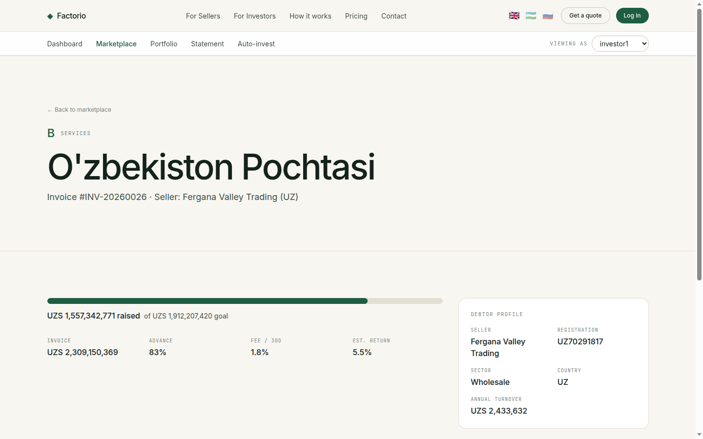

- The headline shows the debtor, risk grade, sector and invoice number.
- A funding panel: amount raised vs goal, advance rate, fee and estimated return.
- A **debtor-company profile** lists registration number, sector, country and annual turnover.
- Everything needed to make a funding decision on a single screen.

---

Investor app · Portfolio

## The reporting cockpit

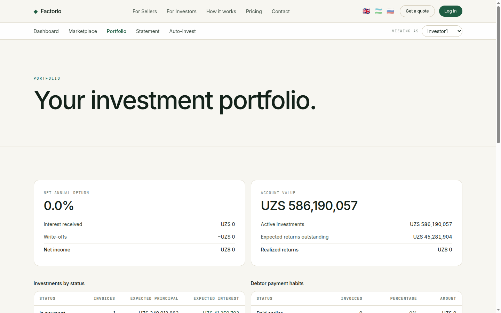

- Two hero panels: **net annual return** (interest received, write-offs, net income) and **account value** (active invested, expected outstanding, realized).
- An **investments aging table** buckets active positions by days to / past due.
- A **payment-habits table** shows how settled invoices actually paid — early, on time, late or written off.
- A positions table lists every investment with realized return, settlement date, grade and status.

---

Investor app · Account statement

## Every transaction, filterable

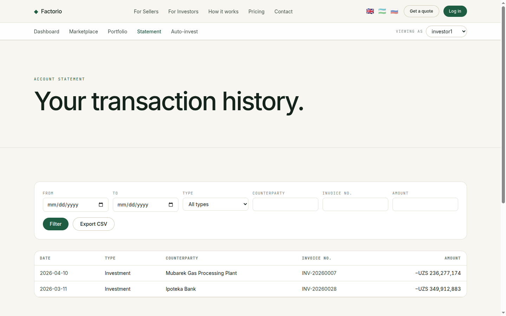

- A unified ledger of cash movements: investments out (−) and settlements in (+).
- Filter by date range, type, counterparty, invoice number and minimum amount.
- Signed amounts in UZS, newest first.
- One-click **CSV export** for bookkeeping and reconciliation.

---

Investor app · Auto-invest

## Set rules, invest automatically

- Configure automated bidding: minimum risk grade, maximum amount per invoice and preferred sectors.
- Toggle the strategy active/inactive; the status is shown at the top.
- Rules are saved per investor and applied to matching new invoices.
- Modelled on investly.co's autobidder.

---

Get started

## Start with Factorio

- **Sellers** — submit an invoice and get an offer in 1–3 working days.
- **Investors** — browse the marketplace, build a portfolio, automate with auto-invest.
- Live at **factorio.co.uk** · hello@factorio.io
