# Factorio — Руководство пользователя
## Факторинг счетов — от начала до конца

Сформировано 2026-07-06 · Доступно на **factorio.co.uk**

Factorio — это маркетплейс факторинга (финансирования счетов). Компании продают свои неоплаченные счета и получают деньги сегодня; инвесторы финансируют эти счета ради краткосрочного дохода, обеспеченного активами. Это руководство показывает каждый экран — публичный сайт и инвесторское приложение — по одному экрану на слайд.

---

Обзор

## Что такое Factorio

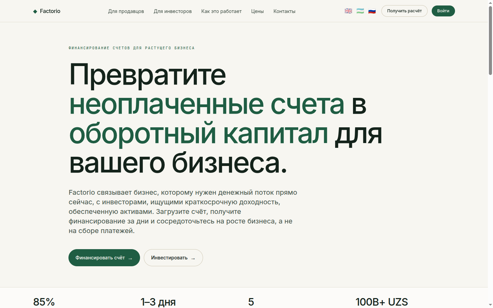

- Маркетплейс факторинга, соединяющий две стороны: **продавцов**, которым нужны деньги сейчас, и **инвесторов**, ищущих краткосрочный доход, обеспеченный активами.
- Один сайт обслуживает обе стороны — маркетинговую витрину и приложение на HTMX.
- Первый экран отражает модель: ставку аванса, срок финансирования, отрасли и общий объём финансирования (UZS).
- Полностью трёхъязычный — английский, узбекский и русский — переключается в верхней навигации.

---

Для продавцов

## Превратите счета в оборотный капитал

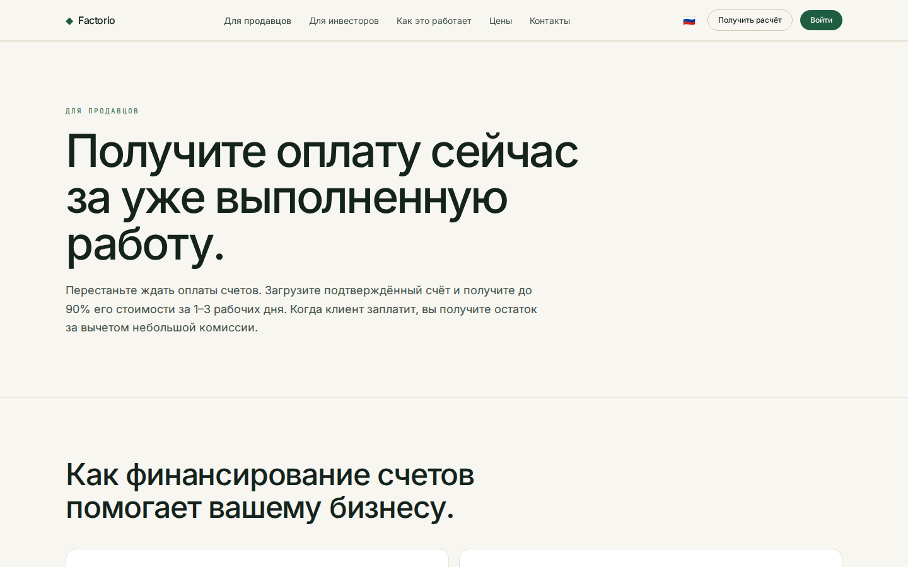

- Получите значительную часть суммы счёта авансом за несколько дней вместо ожидания оплаты 30–120 дней.
- Путь продавца: подать счёт → проверка и присвоение рейтинга риска → получение аванса → расчёт после оплаты должником.
- Это факторинг, а не кредит — без новой задолженности; финансирование растёт вместе с продажами.
- Создано для производства, оптовой торговли, строительства, логистики и услуг.

---

Для инвесторов

## Краткосрочный доход, обеспеченный активами

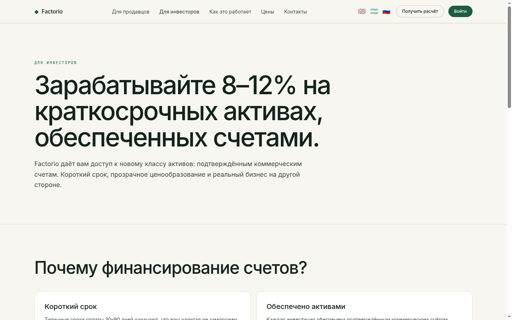

- Финансируйте проверенные счета и получайте доход за короткий срок — часто всего несколько недель.
- Диверсификация по должникам, отраслям и рейтингам риска (A–D).
- Доход привязан к реальной дебиторской задолженности, а не к рыночным спекуляциям.
- Ведёт в инвесторское приложение — дашборд, маркетплейс и портфель.

---

Как это работает

## Четыре шага, от начала до конца

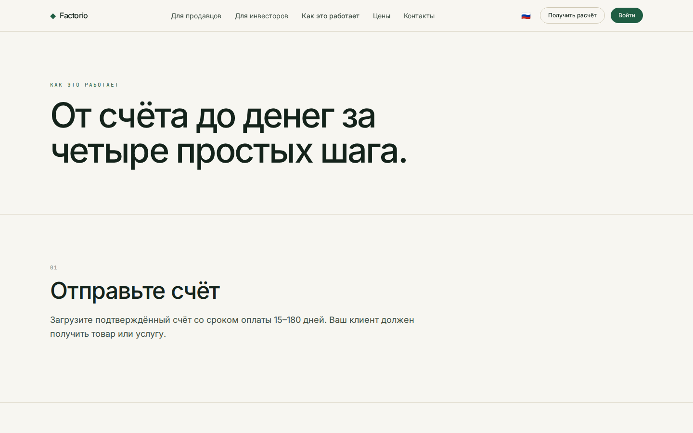

- **Подача** — продавец загружает счёт и данные компании.
- **Проверка** — Factorio проверяет должника и присваивает рейтинг риска и цену.
- **Финансирование** — счёт появляется на маркетплейсе; инвесторы финансируют его до цели.
- **Расчёт** — после оплаты должником распределяются основная сумма и проценты, позиция закрывается.

---

Как движутся деньги

## Откуда каждая сторона получает деньги

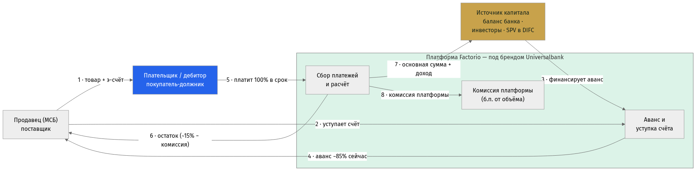{: .diagram }

Поток денег и платежей — продавец, плательщик, платформа, капитал

- **Продавец** поставляет товар и выставляет э-счёт в SoliqOnline; **плательщик (дебитор)** должен сумму счёта.
- Платформа выдаёт продавцу ~85% сразу, за счёт **источника капитала** — баланса банка, инвесторов или SPV в DIFC.
- В срок **плательщик платит 100%** на счёт сбора; продавец получает остаток, источник капитала — основную сумму и доход, платформа удерживает комиссию за объём.
- Поток одинаков независимо от того, кто финансирует — именно поэтому слой инвесторов / SPV подключаемый.

---

Путь · Заёмщик (origination)

## Путь продавца, от начала до конца

{: .diagram }

От регистрации до аванса за 24–48 часов

- Регистрация (KYC банка) → счёт импортируется из SoliqOnline → запрос финансирования в чате AI-триажа.
- Скоринг дебитора возвращает индикативные условия; банк одобряет в один клик; залог регистрируется в ЦБ менее чем за час.
- Аванс поступает на счёт продавца за 24–48 часов — без визита в отделение и без бумаг.

---

Путь · Инвестор

## Путь инвестора, от начала до конца

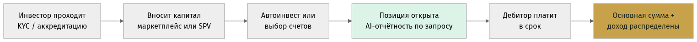{: .diagram }

От онбординга до распределения дохода

- Онбординг (KYC / аккредитация) → внесение капитала через маркетплейс или SPV → автоинвест или выбор счетов.
- Позиция удерживается с AI-отчётностью по запросу; когда дебитор платит в срок, распределяются основная сумма и доход.
- **Декомпозируемо:** часть origination (за счёт банка) можно запустить первой; маркетплейс инвесторов и SPV подключаются позже, независимо.

---

Тарифы

## Прозрачные тарифы за каждый счёт

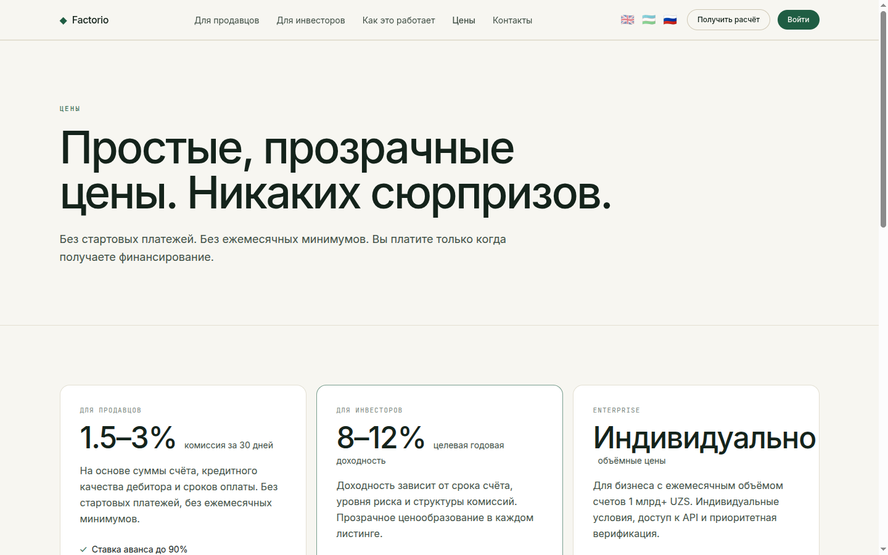

- Тариф рассчитывается за каждый счёт — комиссия за 30 дней от суммы аванса, без скрытых платежей.
- Показаны базовая ставка аванса и наглядный пример расчёта.
- Без подписки и без обязательств при подаче счёта.
- Понятная разбивка, чтобы обе стороны видели доход и стоимость.

---

Контакты

## Связаться с нами

- Страница контактов для продавцов и инвесторов, чтобы связаться с командой Factorio.
- Показаны контактный e-mail и простая форма обращения.
- Точка входа для начала подключения.

---

Приложение · Дашборд

## Ваш персональный обзор

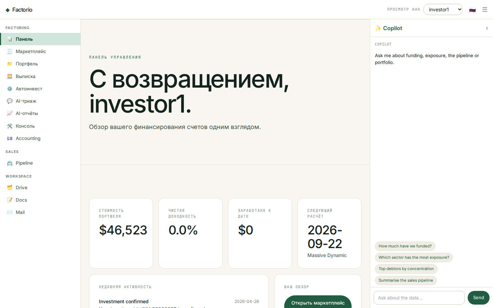

- Главная `/app` приветствует текущего инвестора и показывает его KPI: стоимость портфеля, чистую годовую доходность, заработанное и ближайший расчёт.
- Лента активности отражает уведомления — финансирования, расчёты и обновления.
- Быстрые действия ведут в маркетплейс, портфель и выписку.
- Общая статистика платформы вынесена во вторичную полосу.
- **Переключатель инвестора** справа вверху позволяет смотреть приложение от лица любого инвестора (демо, без пароля).

---

Приложение · Маркетплейс

## Просмотр счетов для финансирования

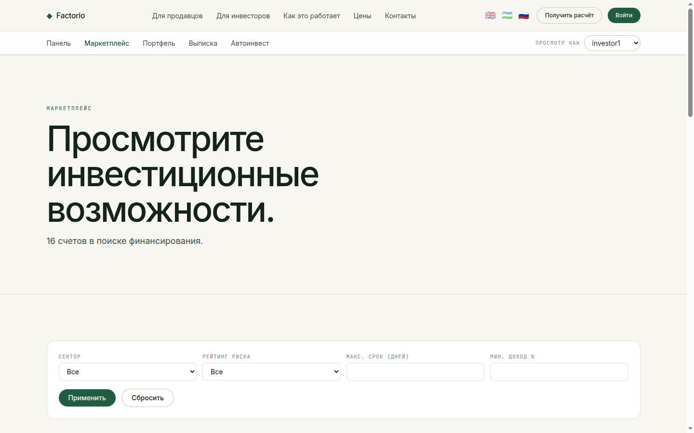

- Каждый открытый счёт — это карточка: должник, отрасль, рейтинг риска, сумма и шкала прогресса финансирования.
- На карточке видны ключевые показатели — ставка аванса, комиссия за 30 дней и ожидаемая доходность — а также срок удержания в днях.
- Панель фильтров сужает выбор по отрасли, рейтингу риска, максимальному сроку и минимальной доходности.
- Нажмите на карточку, чтобы открыть подробности счёта.

---

Приложение · Детали счёта

## Полная прозрачность перед инвестицией

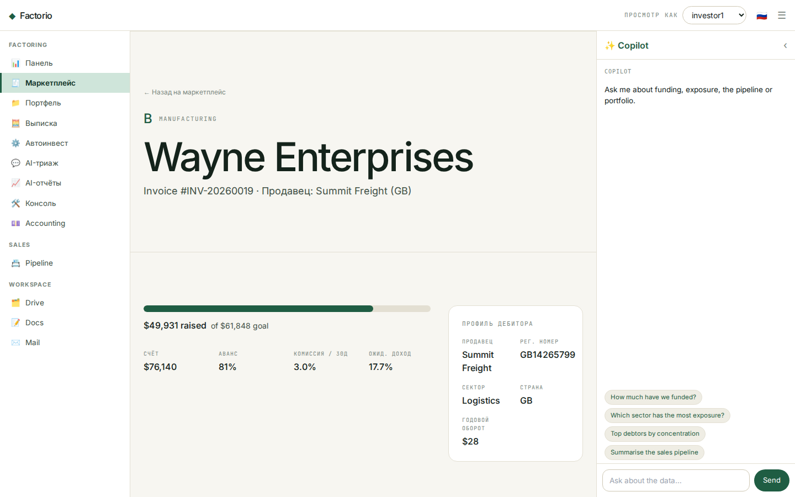

- В заголовке — должник, рейтинг риска, отрасль и номер счёта.
- Панель финансирования: собрано против цели, ставка аванса, комиссия и ожидаемая доходность.
- Блок **профиля компании-должника**: регистрационный номер, отрасль, страна и годовой оборот.
- Всё необходимое для решения о финансировании на одном экране.

---

Приложение · Портфель

## Аналитическая панель

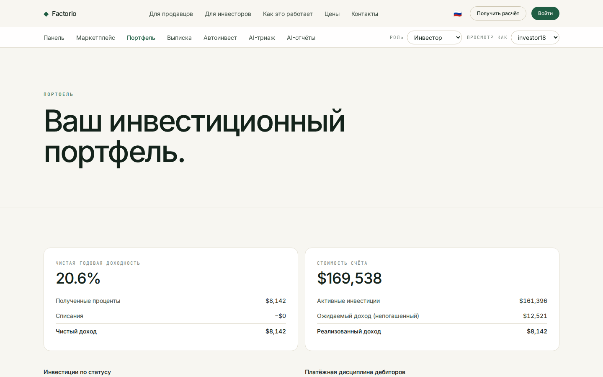

- Две главные панели: **чистая годовая доходность** (полученные проценты, списания, чистый доход) и **стоимость счёта** (активные вложения, ожидаемое к получению, реализованное).
- **Таблица старения вложений** распределяет активные позиции по сроку до / после погашения.
- **Таблица платёжной дисциплины** показывает, как фактически платили по закрытым счетам — раньше, в срок, с опозданием или списание.
- Таблица позиций перечисляет каждую инвестицию с реализованным доходом, датой расчёта, рейтингом и статусом.

---

Приложение · Выписка по счёту

## Каждая операция, с фильтрами

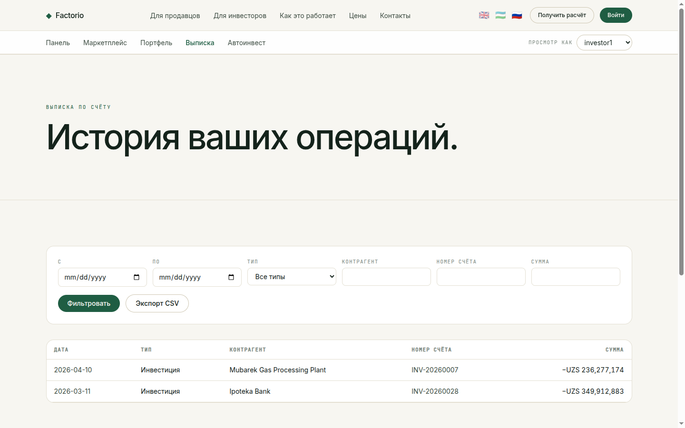

- Единый реестр движения средств: вложения (−) и поступления по расчётам (+).
- Фильтрация по периоду, типу, контрагенту, номеру счёта и минимальной сумме.
- Суммы со знаком в UZS, новые сверху.
- **Экспорт в CSV** в один клик для учёта и сверки.

---

Приложение · Авто-инвестирование

## Задайте правила — инвестируйте автоматически

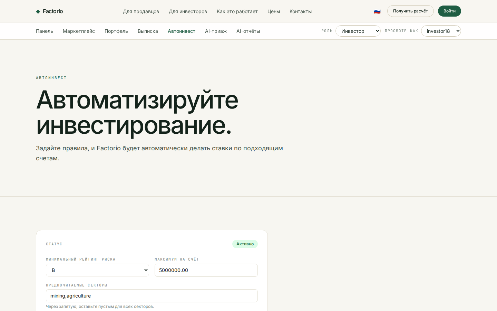

- Настройте автоматические заявки: минимальный рейтинг риска, максимальную сумму на счёт и предпочитаемые отрасли.
- Включайте и выключайте стратегию; статус показан сверху.
- Правила сохраняются для каждого инвестора и применяются к подходящим новым счетам.
- Создано по образцу автобиддера investly.co.

---

AI · Триаж заявок

## Триаж счёта в чате

- Продавцы описывают счёт и должника обычными словами; ассистент запрашивает только недостающее.
- Он возвращает **индикативный уровень риска (A–D)**, **ставку аванса** и **список документов для банка** — за секунды, а не за дни.
- На базе **Grok (x.ai)**; все данные индикативны и подлежат проверке — окончательное решение не автоматизируется.
- Полностью трёхъязычный — ассистент отвечает на языке посетителя (английский, узбекский, русский).

---

AI · Отчёты по портфелю

## Спросите свой портфель о чём угодно

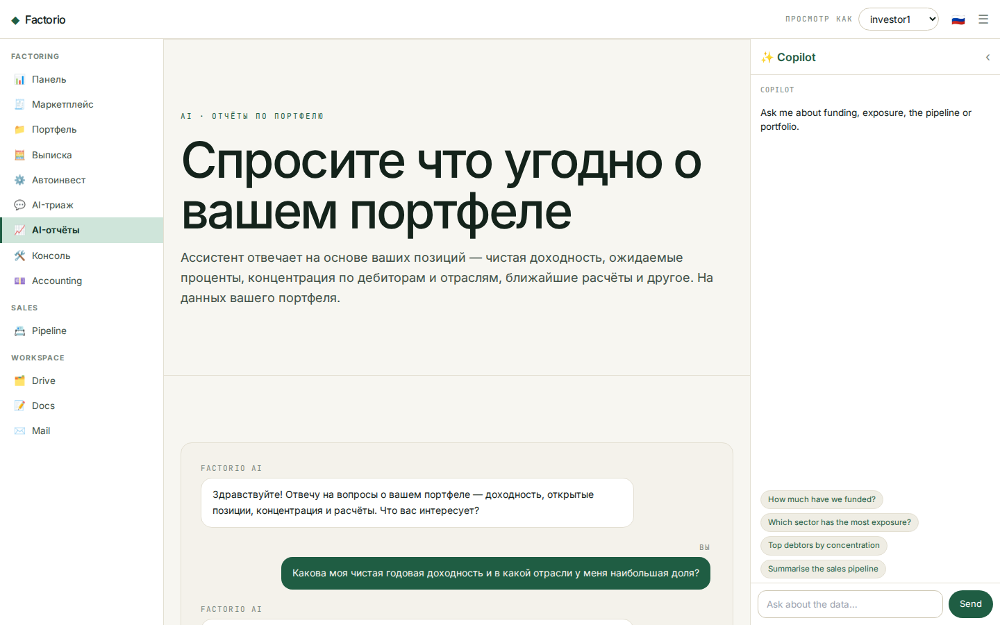

- Инвесторы задают вопросы на естественном языке — чистая доходность, доля по отраслям или должникам, просроченные позиции, ближайшие расчёты.
- Ответы **основаны на реальных позициях инвестора** — каждая цифра восходит к данным портфеля, а не выдумана.
- Конкретно и точно: приводятся реальные суммы и номера счетов, а при нехватке данных об этом честно сообщается.
- Разговорный слой поверх аналитической панели портфеля — отчётность по запросу, на языке инвестора.

---

Начало работы

## Начните с Factorio

- **Продавцам** — подайте счёт и получите предложение за 1–3 рабочих дня.
- **Инвесторам** — изучайте маркетплейс, формируйте портфель, автоматизируйте через авто-инвестирование.
- Доступно на **factorio.co.uk** · hello@factorio.co.uk
