

Финансирование счетов, от и до

<h1>Factorio — Руководство пользователя</h1>

Доступно на <strong>factorio.co.uk</strong> · hello@factorio.co.uk

Factorio — это маркетплейс финансирования счетов (факторинга). Компании продают
свои неоплаченные счета, получая деньги сегодня; инвесторы финансируют эти счета
ради краткосрочной, обеспеченной активами доходности; а бэк-офис ведёт кредитную
работу, финансирование и взыскание за кулисами.

Это руководство построено по принципу **«кто вы»**. Оно разделено на четыре
чётко обособленные части — по одной на каждую роль. Перейдите к нужной части;
каждая начинается с новой страницы и цветного разделителя.

| Часть | Роль | Вход как | Что вы делаете |
|---|---|---|---|
| **1** | **Инвестор** | Investor | Финансируете проверенные счета; ведёте портфель краткосрочной, обеспеченной доходности |
| **2** | **Поставщик** | Seller | Продаёте / дисконтируете неоплаченные счета, получая деньги за 24–48 часов |
| **3** | **Плательщик** | Payer | Подтверждаете счета, которые должны; запускаете программы досрочной оплаты поставщикам |
| **4** | **Администратор** | Admin | Управляете факторинговым бизнесом — онбординг, риск, финансирование, взыскание, комплаенс |

Часть 1 из 4 · Вход как «Investor»

<h1>Инвестор</h1>

Вкладывайте капитал в проверенные счета ради краткосрочной, обеспеченной активами доходности.

**Для инвесторов / фондирующих.** Приложение — это кокпит с левой навигацией и
ИИ-**копайлотом** справа для вопросов о вашем портфеле и рынке. Суммы показаны в
USD (поддерживается мультивалютность).

## Панель
Ваш персональный обзор: **стоимость портфеля, чистая годовая доходность,
заработано к дате и следующий расчёт**, лента последних событий и быстрые
действия.

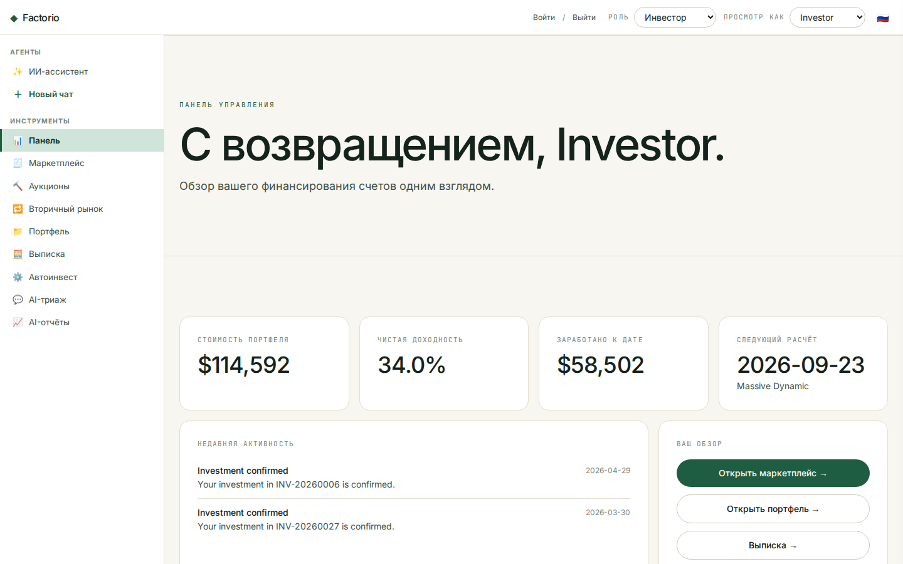

## Маркетплейс
Каждый открытый, доступный для финансирования счёт — это карточка: дебитор,
сектор, кредитный рейтинг (A–D), сумма и живой индикатор прогресса
финансирования, а также ставка аванса, комиссия и ожидаемая доходность.
Фильтруйте по сектору, рейтингу, сроку и минимальной доходности.

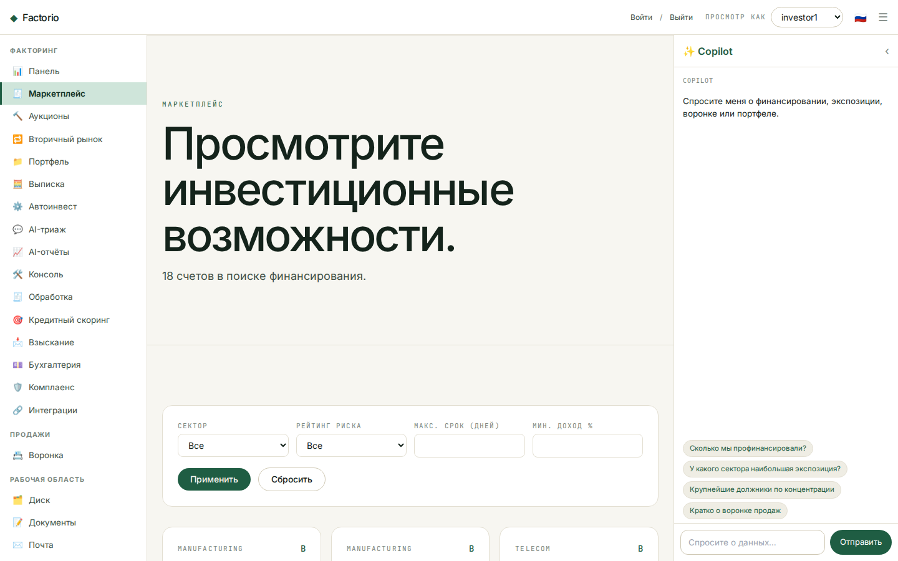

## Детали счёта
Полная прозрачность перед финансированием: панель финансирования (собрано против
цели, аванс, комиссия, ожидаемая доходность) и **профиль компании-дебитора**
(регистрация, сектор, страна, оборот).

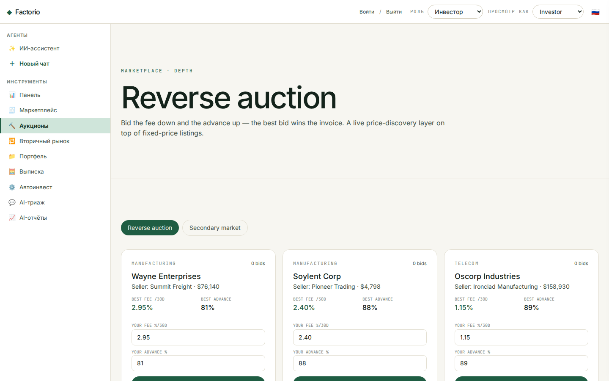

## Портфель
Кокпит отчётности: панели **чистой годовой доходности** и **стоимости счёта**,
**таблица старения** (дней до / после срока), **таблица платёжной дисциплины**
(как фактически оплачивались закрытые счета) и таблица позиций.

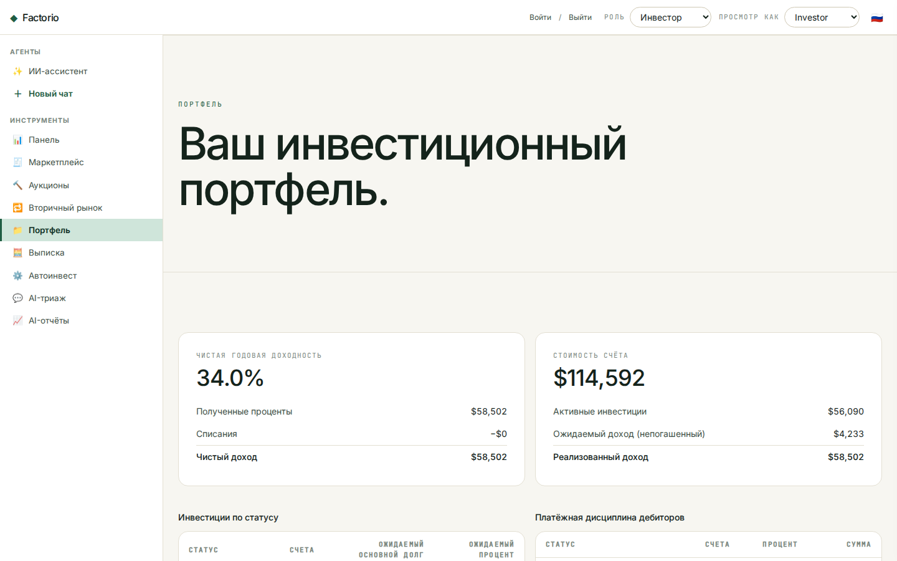

## Выписка
Единый реестр движений денежных средств — инвестиции (−) и расчёты (+) — с
фильтрами по дате, типу, контрагенту и сумме, с экспортом в CSV.

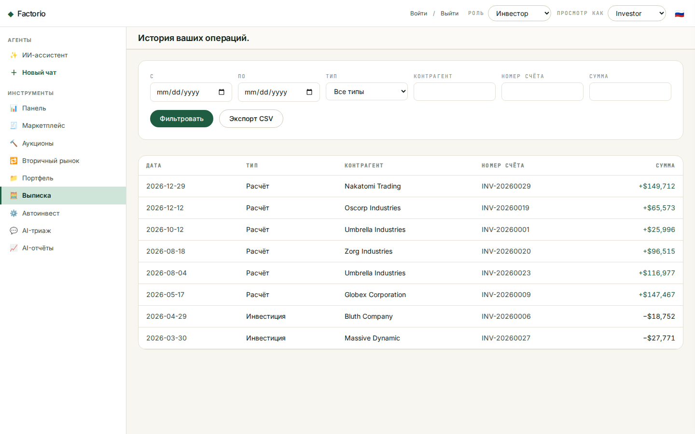

## Автоинвест
Автоматические ставки по правилам: минимальный кредитный рейтинг, максимальная
сумма на счёт и предпочитаемые секторы — применяются к подходящим новым счетам.

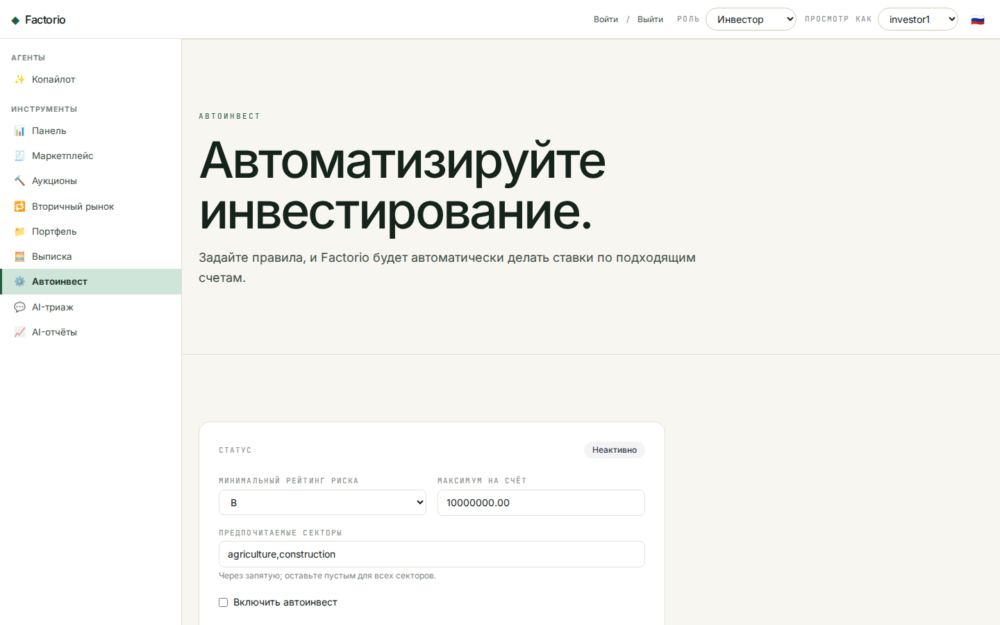

## ИИ-отчёты (копайлот)
Задавайте вопросы, опираясь на ваши собственные живые позиции — чистая
доходность, экспозиция по сектору или дебитору, просроченные позиции,
предстоящие расчёты. Копайлот отвечает по реальным данным, а не выдуманным
цифрам.

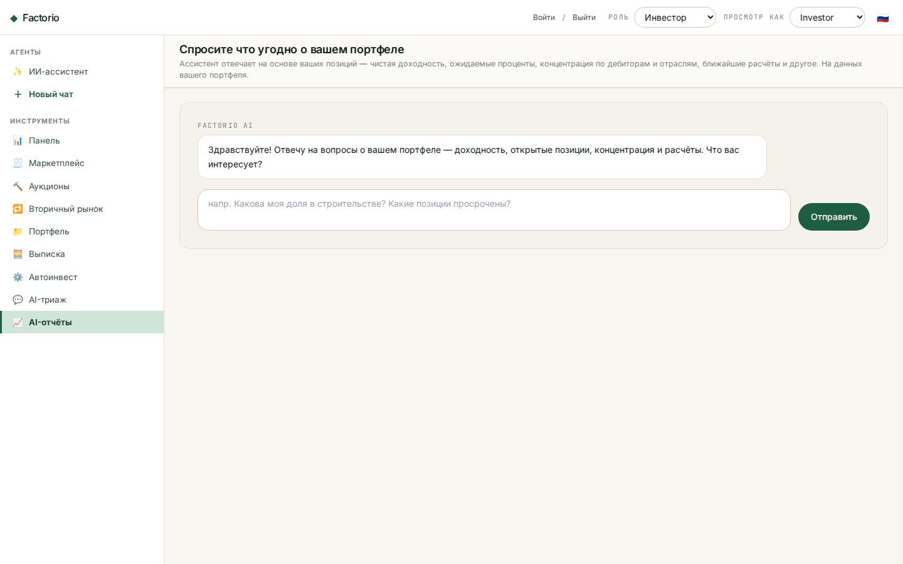

Часть 2 из 4 · Вход как «Seller»

<h1>Поставщик</h1>

Продавайте или дисконтируйте неоплаченные счета, получая деньги сегодня, вместо ожидания 30–90 дней.

**Для поставщиков / клиентов.** Факторинг, а не кредит — никакого нового долга на
балансе; финансирование растёт вместе с продажами. Входите под ролью **Seller**.

## Мои заявки
Ваши поданные счета с дебитором, суммой, кредитным рейтингом и статусом
(подан → проверен → финансируется → профинансирован → закрыт). Отслеживайте
каждый от подачи до аванса.

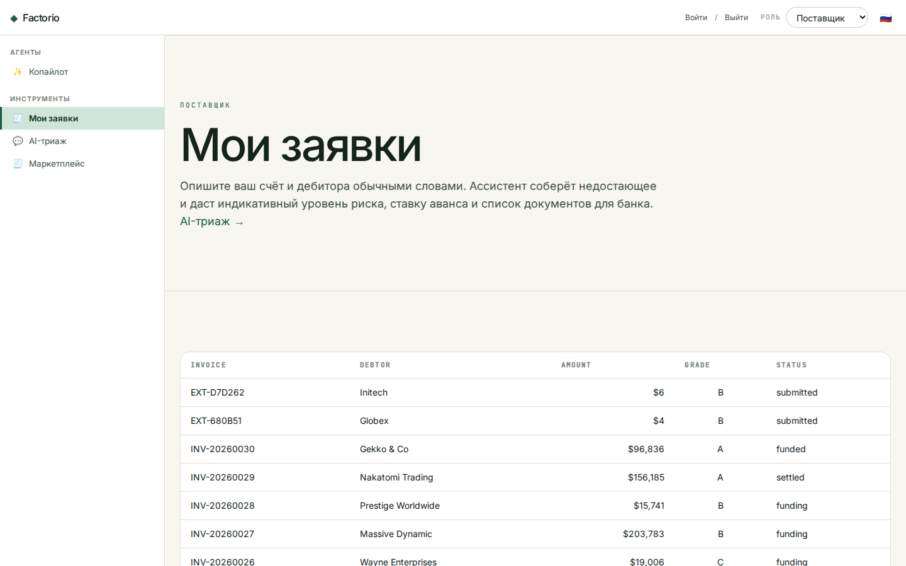

## ИИ-триаж — получите ориентировочное предложение в чате
Опишите счёт и дебитора обычным языком; ассистент запросит только недостающее, а
затем вернёт **ориентировочный диапазон риска (A–D)**, **ставку аванса** и
**документы, которые понадобятся банку далее** — за секунды, на вашем языке. Всё
ориентировочно и подлежит проверке.

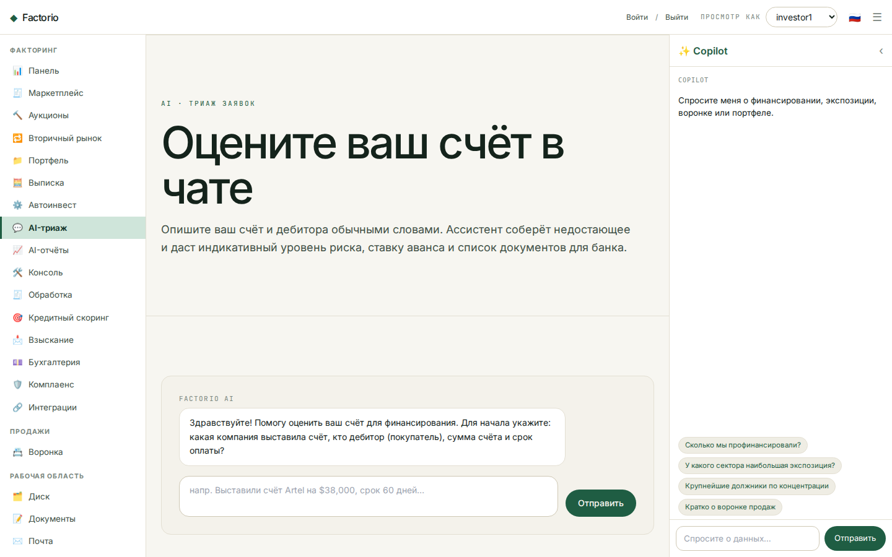

## Путь поставщика
1. **Регистрация** (KYC банка).
2. **Подача / импорт** счёта (проверен в SoliqOnline, подтверждён покупателем).
3. **Триаж** в чате → ориентировочные условия.
4. **Одобрение** банком (в один клик) → залог зарегистрирован.
5. **Аванс** на вашем счёте за 24–48 часов; резерв высвобождается, когда дебитор
   платит.

Часть 3 из 4 · Вход как «Payer»

<h1>Плательщик</h1>

Подтверждайте счета, которые должны, чтобы ваших поставщиков могли профинансировать — и платите сети досрочно, не нарушая своих условий.

**Для плательщиков / дебиторов** — покупателей, которые должны по счетам.
Плательщик закрепляет кредит в факторинге: конкретное, подтверждённое покупателем
обязательство. Входите под ролью **Payer**.

## Счета к подтверждению
Счета, где вы указаны дебитором, с суммой, сроком оплаты и статусом.
**Подтвердите** обязательство (или оспорьте его) — именно подтверждение
позволяет поставщику получить аванс; на рельсах SoliqOnline это подтверждение
фиксируется официально.

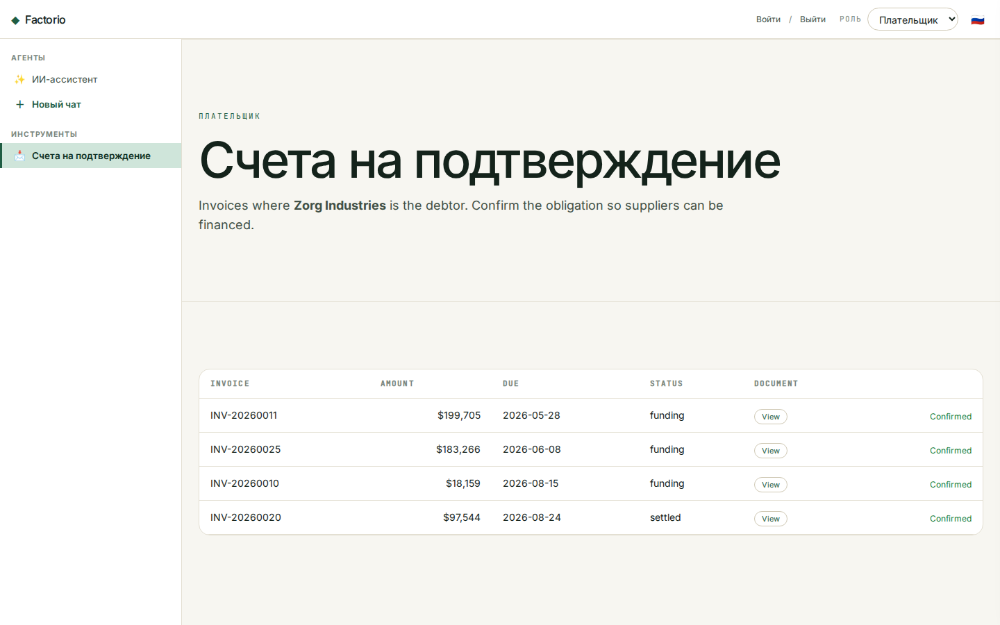

## Обратный факторинг (финансирование цепочки поставок)
Как крупный покупатель вы можете запустить **программу обратного факторинга**:
одобрять досрочную оплату сотням поставщиков сразу. Поставщики получают деньги
раньше; вы сохраняете свои условия оплаты; платформа (фондируемая банком,
инвесторами или SPV) закрывает разрыв.

Часть 4 из 4 · Вход как «Admin»

<h1>Администратор — Бэк-офис</h1>

Управляйте факторинговым бизнесом: онбординг, риск, финансирование, взыскание, бухгалтерия и комплаенс — с ролевым доступом и полным журналом аудита.

**Для внутренних пользователей: операции, кредит, взыскание, финансы, комплаенс,
руководители.** Доступно по адресу **`/app/admin`**. Рабочее пространство —
кокпит из трёх панелей: левая навигация (Факторинг · Продажи · Рабочая область),
центральный контент и правый **копайлот**. Переключатель **Роль** (справа
сверху) меняет роль; подроль (Операции / Кредит / Взыскание / Финансы /
Комплаенс / Руководитель / Супер-админ) определяет доступные действия
(**разделение обязанностей**).

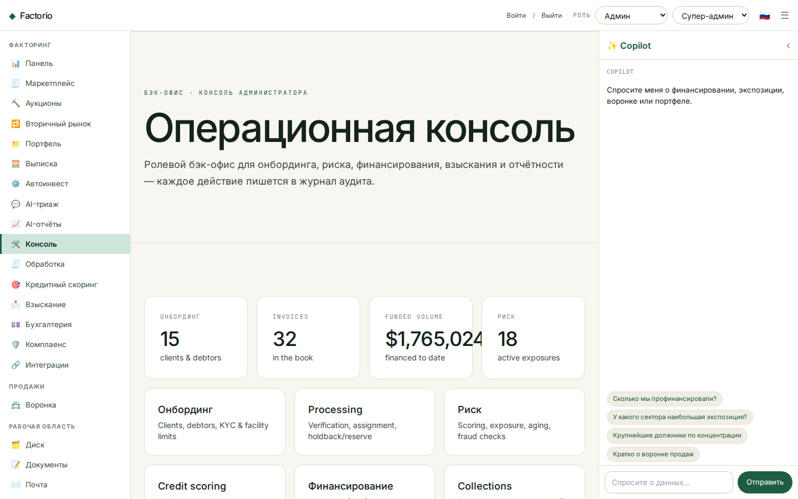

## 1 · Онбординг и управление клиентами / дебиторами
**Экран: Онбординг.** Статус KYC/AML по каждому клиенту и дебитору, сектор,
страна, годовой оборот и производный **лимит финансирования** (ставки аванса
70–90%). Устанавливать лимиты могут только **Кредит / Комплаенс / Супер** —
остальные видят данные только для чтения.

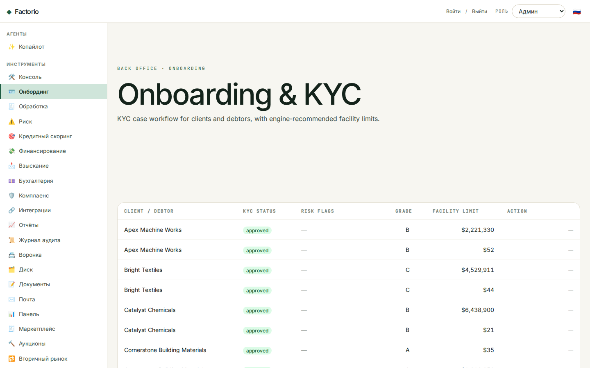

## 2 · Обработка и проверка счетов
Счета поступают проверенными в SoliqOnline (подтверждены покупателем),
назначаются и получают кредитный рейтинг. Пайплайн и детальные экраны показывают
сумму, ставку аванса, рейтинг и статус; удержание/резерв — это разница между
номиналом и авансом.

## 3 · Финансирование и выплаты
**Экран: Финансирование.** Пайплайн финансирования перечисляет проверенные /
финансируемые счета с суммой, рейтингом, рассчитанным авансом и статусом.
**Одобрить и выдать** доступно только **Финансам / Супер** — кредитный
специалист не может выдавать средства. Каждое одобрение пишется в журнал аудита.

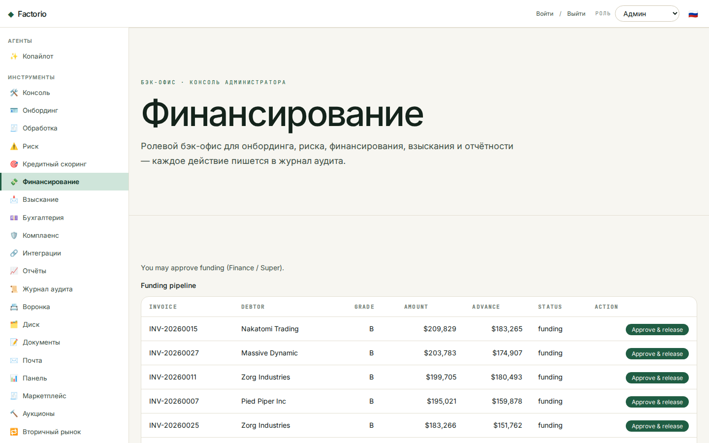

## 4 · Взыскание и управление кредитом
Тот же экран: таблица **просрочки / взыскания** со стадией напоминаний по каждому
счёту. Напоминания эскалируются; споры и списания обрабатываются здесь (списание
доступно Финансам/Комплаенс).

## 5 · Управление риском и андеррайтинг
**Экран: Риск.** Распределение кредитных рейтингов (A–D), **экспозиция по
сектору**, **концентрация по дебиторам** и **проверка на дубликаты счетов
(фрод)**.

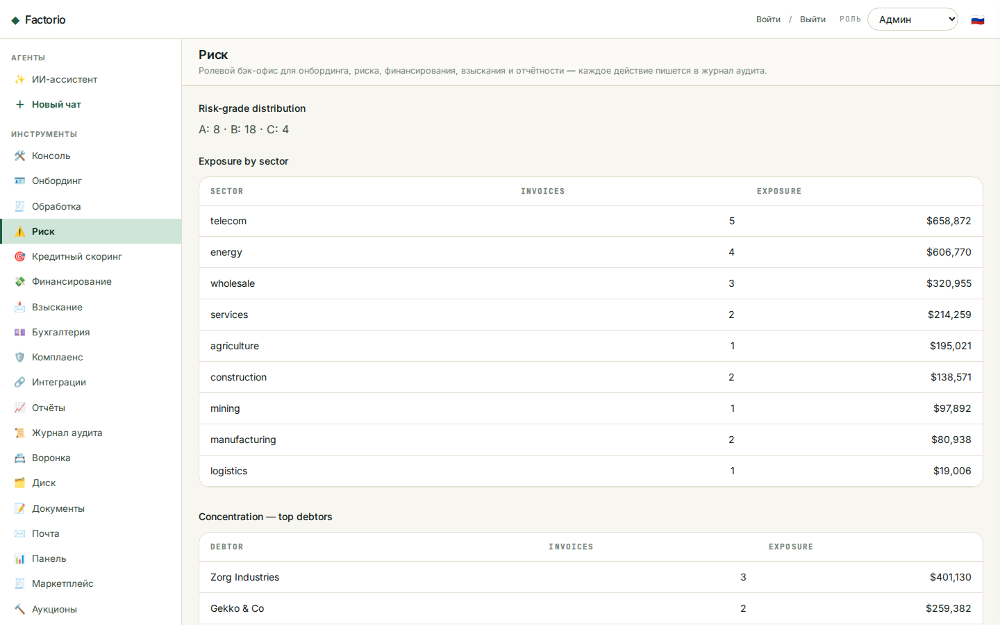

**Экран: Кредитный скоринг (продакшн).** Многосигнальный скоринг дебитора,
объединяющий наблюдаемую историю платежей/дефолтов, концентрацию и отраслевой
риск с сигналами кредитного бюро и денежных потоков (open banking). Он выдаёт
**балл (0–100), рейтинг (A–D), ориентировочную ставку аванса и цену**, а также
понятные **причины отказа**. Модель задаёт цифры; человек утверждает. Доступно
Кредиту / Комплаенс / Руководителю / Супер.

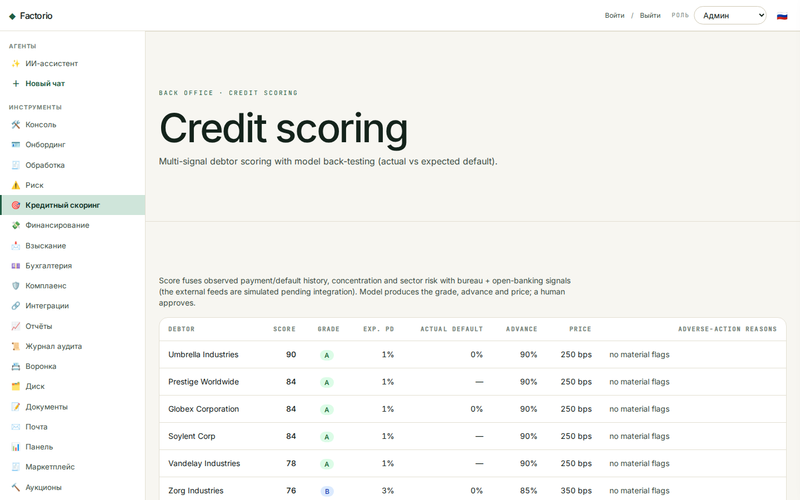

**Бэк-тестирование модели.** Ключевое отличие: **фактический против ожидаемого
уровня дефолта** по рейтингам — метрика точности модели — чтобы дрейф калибровки
был виден и модель можно было перенастроить.

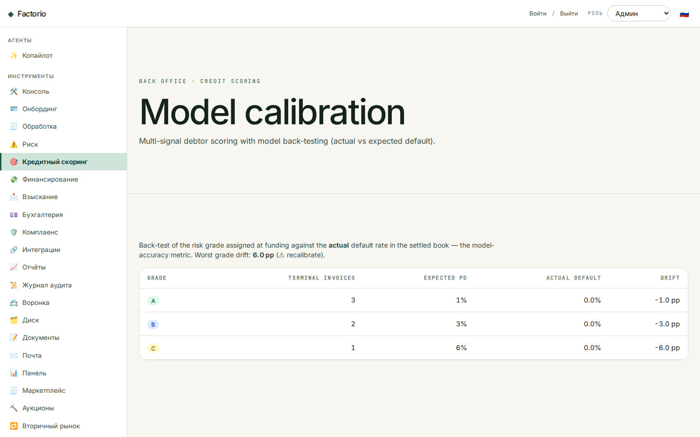

## 6 · Бухгалтерия и финансовые операции
**Экран: Бухгалтерия.** **Продакшн-книга двойной записи**, детерминированно
выводимая из факторинговых событий (авансы, расчёты, комиссии, списания), поэтому
она всегда сходится. Включает **оборотно-сальдовую ведомость**, **журнал**,
детализацию **по счетам** и **банковскую сверку** (сопоставлено / не
сопоставлено). Доступно Финансам / Комплаенс / Руководителю / Супер.

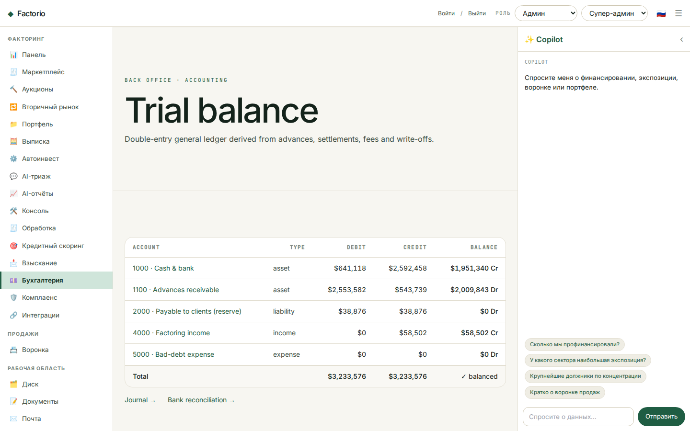
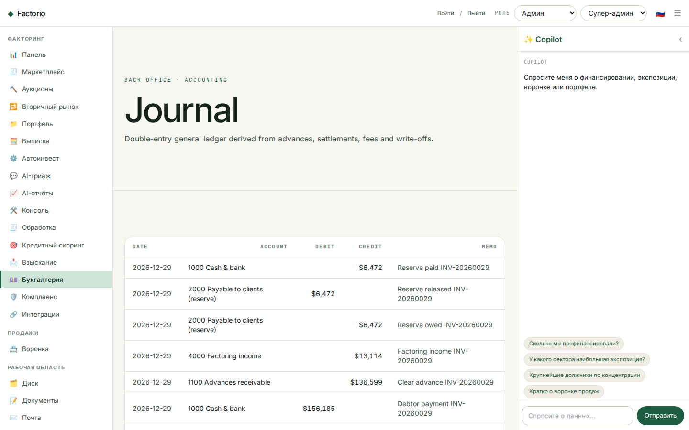
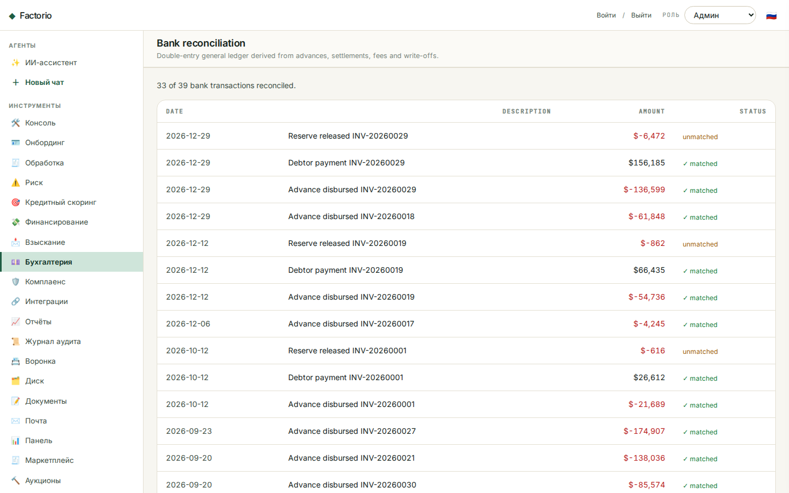

## 7 · Отчётность и аналитика
KPI отчётности (DSO, уровень дефолта, объём финансирования по секторам) плюс
**копайлот**: спросите «у какого сектора наибольшая экспозиция?», «крупнейшие
должники», «кратко о пайплайне» — и получите обоснованные ответы с реальными
цифрами.

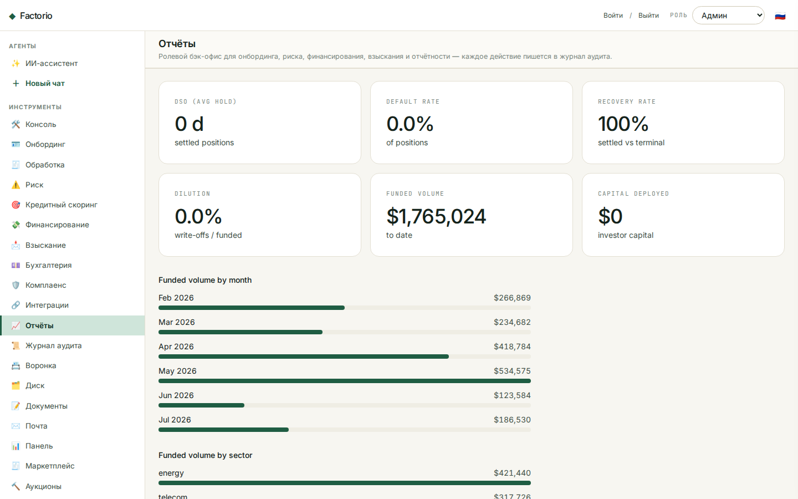

## 8 · Комплаенс, право и аудит
**Экран: Журнал аудита.** Каждое изменяющее состояние действие — кто (актор +
роль), какое действие, над какой сущностью, когда — записывается неизменяемо. Это
основа разделения обязанностей, регуляторной отчётности и доказательной базы в
спорах.

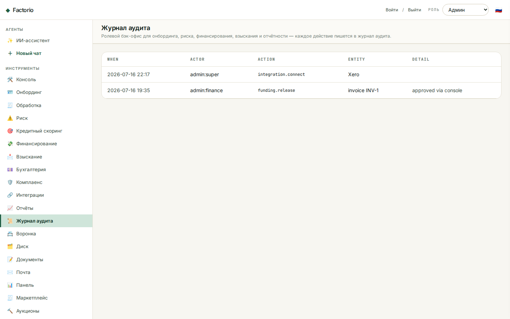

## Модули рабочей области (инструменты бэк-офиса)

**Воронка продаж (CRM).** Канбан-воронка для продаж бэк-офиса — сделки по стадиям
(Квалификация → Демо → Предложение → Переговоры → Готово к закрытию), сумма и
владелец.

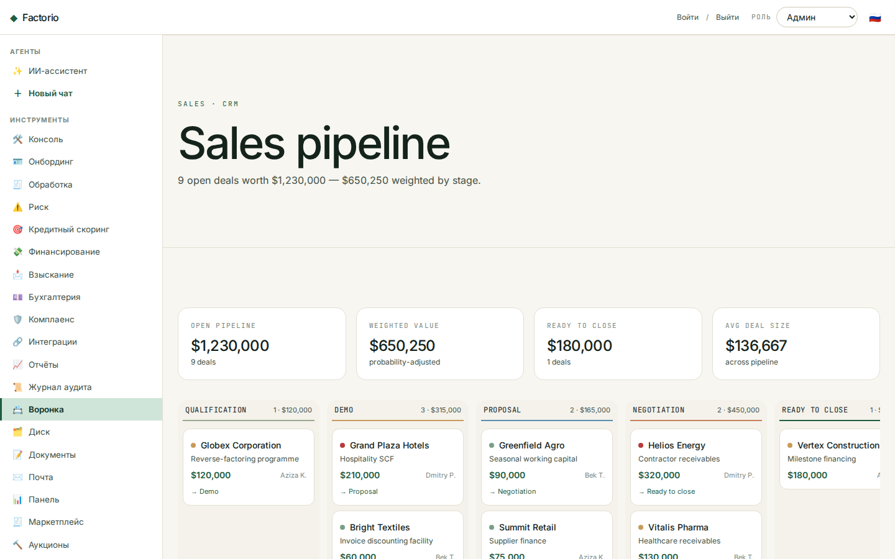

**Диск · Документы · Почта.**

- **Диск** — документы по счетам, KYC и залогу (папки, доступ, ссылки).
- **Документы** — политики, регламенты и термшиты (блочный редактор, версии).
- **Почта** — переписка с клиентами, дебиторами и бюро (треды, ИИ-черновики
  ответов).

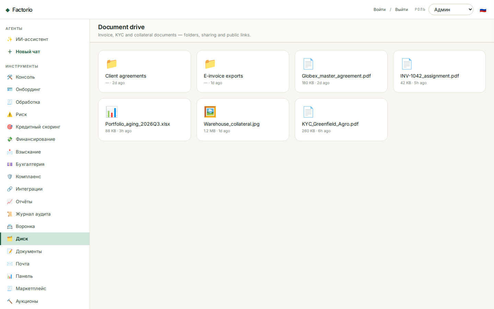
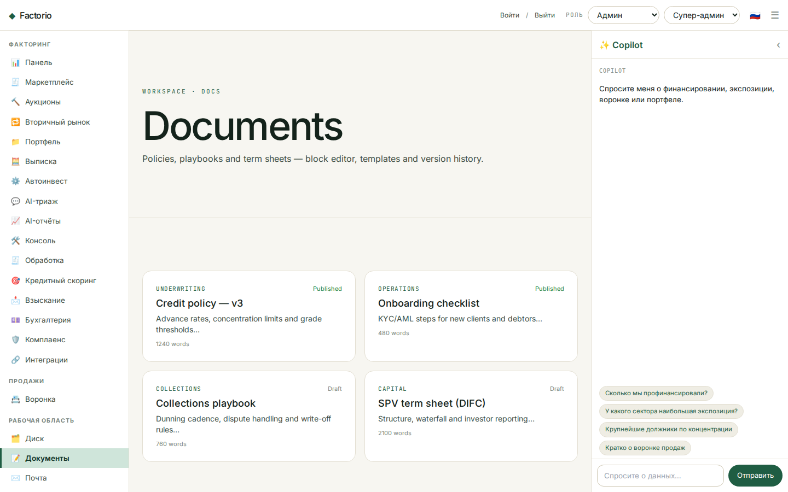
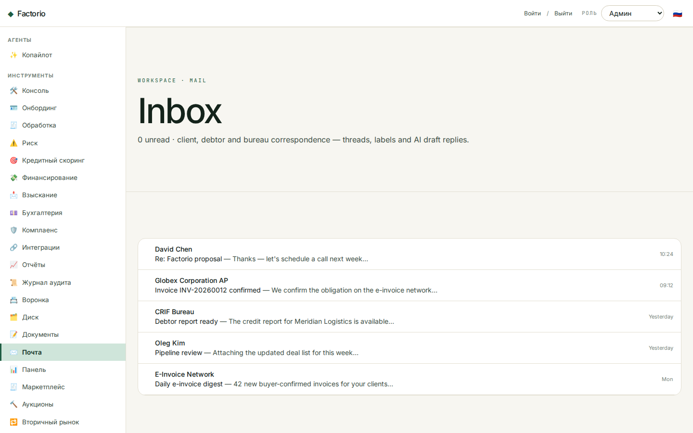

## Ролевой доступ и разделение обязанностей (сводка)
| Действие | Кто может выполнять |
|---|---|
| Устанавливать лимиты финансирования | Кредит · Комплаенс · Супер |
| Одобрять / выдавать финансирование | Финансы · Супер |
| Вести взыскание / напоминания | Взыскание · Супер |
| Списание / резервирование | Финансы · Комплаенс · Супер |
| Просмотр журнала аудита | Комплаенс · Руководитель · Супер |

---

*Factorio · доступно на factorio.co.uk · hello@factorio.co.uk*
