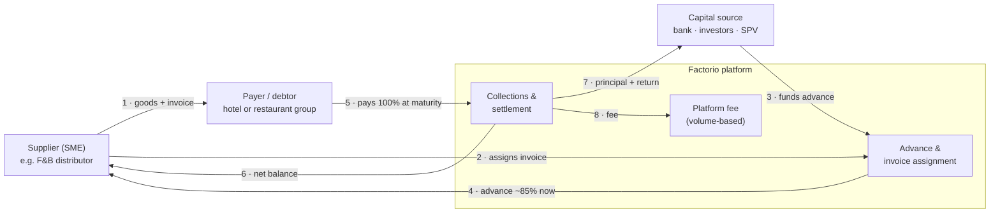
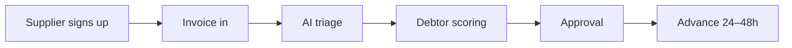
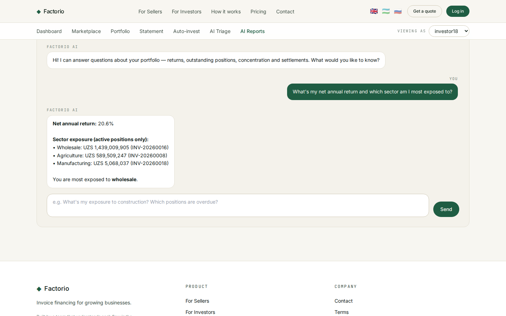

# Factorio for Hospitality

## Invoice finance & supply-chain finance for hotels, restaurants and their suppliers

**A proposal by Consistente Ltd.** An AI-native, multi-currency invoice-finance
platform tailored to the hospitality sector — turning long payment terms and
seasonal cash-flow gaps into working capital for operators and their supplier
networks, and into short-term, asset-backed returns for investors.

*Prepared by Consistente Ltd · Tallinn · info@consistente.tech · consistente.tech*

## 1. Executive summary

- **The problem.** Hospitality runs on thin margins and long, uneven cash cycles:
  operators pay suppliers on 30–90 day terms, OTAs and corporate/event clients
  settle slowly, and demand is seasonal. Suppliers (F&B distributors, linen and
  laundry, events, maintenance) carry the financing gap.
- **The solution.** Factorio finances the receivable — **factoring / invoice
  discounting** for suppliers and **reverse factoring (supply-chain finance)** for
  operators — so suppliers get paid now and operators keep their terms. Priced on
  a **reverse-auction** marketplace so funding costs fall as investor demand rises.
- **AI-native.** Chat-based application triage and investor reporting ship today;
  open-banking-style credit scoring underwrites both the supplier and the debtor.
- **Multi-currency & cross-border.** Built for EUR / USD / GBP and local
  currencies — the norm in a sector with international guests, groups and imports.
- **For investors.** Short-duration, sector-diversified, asset-backed exposure
  with target net returns in the low-to-mid teens (Investly's comparable book
  ran ~13% realised net return at a 0% default rate on verified receivables).

## 2. The hospitality opportunity

Hospitality is a large, fragmented, credit-terms-driven B2B economy — exactly the
shape invoice finance serves best.

- **Long terms, slow payers.** Operators buy on 30–90 day terms; OTAs, corporate
  travel desks and event clients pay slowly. ~80% of B2B trade runs on credit.
- **Seasonality.** Revenue peaks and troughs (summer, festive, events calendar)
  create acute working-capital swings that term loans fit poorly.
- **A deep supplier chain.** Every hotel and restaurant sits on top of F&B
  distributors, beverage wholesalers, linen/laundry, cleaning, maintenance,
  furniture/FF&E, events and staffing suppliers — all financeable.
- **Under-served by banks.** SMEs in the chain are frequently declined for
  unsecured credit; the invoice is a better-secured, self-liquidating asset.

**Why now.** Digitised invoicing and open banking make supplier and debtor
cash-flows verifiable in real time, so underwriting that used to take weeks now
takes seconds — and a marketplace can price the risk competitively.

## 3. Hospitality use cases

| # | Scenario | Product | Who benefits |
|---|---|---|---|
| 1 | An **F&B distributor** waits 60 days on invoices to a hotel group | Factoring / invoice discounting | Distributor gets ~85% advance now |
| 2 | A **hotel group** wants to pay 200 suppliers early without using its own cash | **Reverse factoring / SCF** | Suppliers paid early; group keeps terms |
| 3 | An **events / catering** company fronts costs before a corporate client pays | Factoring (single-invoice / spot) | Immediate liquidity for the next event |
| 4 | A **linen & laundry** supplier needs seasonal working capital | Revolving invoice discounting | Funding scales with sales, not a fixed loan |
| 5 | A **boutique hotel** bills an OTA / corporate desk in another currency | Cross-border factoring (multi-currency) | Paid now, FX handled by the platform |

Each maps to the same money flow (§5) — only the capital source and the
notification model (disclosed vs confidential) change.

## 4. The platform

- **AI triage (seller side).** A supplier describes an invoice in plain language;
  the assistant returns an indicative risk band (A–D), advance rate and the
  documents needed — in seconds. *(Live prototype — see Appendix A.)*
- **AI reporting (investor side).** Investors ask questions grounded in their own
  live positions — exposure by sector/debtor, overdue positions, upcoming
  settlements. *(Live prototype.)*
- **Open-banking-style credit scoring.** Fuses accounting data, bank-transaction
  cash-flow signals and bureau data to score **both the supplier and the debtor**,
  with model back-testing (actual vs expected default) — Investly's discipline.
- **Reverse-auction pricing.** Investors bid rate + amount; the supplier gets the
  lowest available cost of funds. Fixed-rate offers also supported.
- **Multi-currency.** EUR / USD / GBP / local, per-facility base currency, FX for
  cross-border deals.
- **Sector-aware.** Hospitality is a first-class dimension for concentration
  limits, risk analytics and tailored onboarding.

## 5. How the money moves

The **payer (debtor)** — the hotel or restaurant group — anchors the credit. In a
reverse-factoring programme the payer initiates and approves early payment for its
suppliers; in factoring the supplier initiates. Either way the flow, and the
pluggable capital layer (bank → investors → SPV), is identical.

## 6. Journeys

**Supplier (origination):** sign up (KYC) → invoice imported / uploaded → request
financing in an AI-triage chat → debtor scoring + indicative terms → approval →
advance in 24–48 hours.

**Investor:** onboard (KYC / accreditation) → commit capital (marketplace or SPV)
→ auto-invest or pick invoices → hold with AI reporting → principal + return
distributed at maturity → reinvest or trade on the secondary market.

## 7. Pricing & returns (illustrative, Investly-informed)

| Party | Economics |
|---|---|
| **Supplier fee** | ~1.5–2.5% per invoice financed (effective APR ~18–30% vs 24–48% traditional factoring) |
| **Advance rate** | 70–90% of invoice value; reserve released on debtor payment |
| **Investor return** | Target low-to-mid teens net; short duration (avg ~30–60 days) |
| **Secondary market** | ~1% on position trades (liquidity for investors) |
| **Platform (Consistente)** | Volume-based basis points — paid only on financed volume; no SaaS licence |

Reverse-auction competition drives the supplier's cost toward the floor while
still clearing investor demand — the mechanism that let Investly undercut both
banks and first-generation invoice-trading platforms.

## 8. Investor capital & SPV

Funding is a **pluggable layer**: an operator or bank balance sheet, a retail /
institutional investor marketplace, or a **bankruptcy-remote SPV** for
international and (optionally) Shariah-compliant capital — the same structure set
out in `universalbank_consistente_proposal`. Hospitality receivables are
**uncorrelated** with real estate and equities, giving investors genuine
diversification with short duration.

## 9. Roadmap

| Phase | Focus |
|---|---|
| **0 · now** | AI triage + reporting live; sector-aware onboarding; multi-currency |
| **1 · M1–3** | Supplier onboarding, invoice verification, factoring GA for one hospitality corridor |
| **2 · M3–6** | Reverse-factoring (SCF) for anchor hotel groups; open-banking scoring |
| **3 · M6–12** | Investor marketplace + reverse-auction; secondary market; SPV / international capital |
| **4 · Y2+** | Accounting / bank-API / bureau / e-sign integrations; public API; scale across corridors |

## 10. Why Consistente

Consistente Ltd (Tallinn, EU) builds **production-grade AI for regulated
industries** — reproducible pipelines, versioned models, auditable prompts — with
a financial-services track record (LSEG, DBRS Morningstar, ARM, Microsoft). The
Factorio platform is running today; the AI triage and reporting in Appendix A are
live, not mock-ups.

**Next step.** A short call to walk through the platform and a live demonstration.
Contact: Consistente Ltd · info@consistente.tech · consistente.tech.

# Appendix A — Product user guide

An end-to-end tour of the platform. Screens are shown in Appendix B.

**Public site**
- **Home** — the marketplace model at a glance: advance rate, days-to-funding,
  sectors served, multi-currency, and language switch (EN / UZ / RU / ES / FR).
- **For sellers** — turn invoices into working capital in days; factoring, not a
  loan; no new debt on the balance sheet.
- **For investors** — short-term, asset-backed returns; diversify across debtors,
  sectors and risk grades (A–D).
- **How it works** — submit → verify → fund → settle.
- **Pricing** — transparent, per-invoice fees; volume-based platform pricing.

**Investor app**
- **Dashboard** — personalised KPIs: portfolio value, net annual return, earned to
  date, next settlement; recent-activity feed.
- **Marketplace** — every fundable invoice as a card: debtor, sector, risk grade,
  amount, funding progress; filter by sector/grade/term/return.
- **Invoice detail** — full transparency before funding: funding panel + debtor
  company profile.
- **Portfolio** — net-return and account-value panels, aging table, payment-habits
  table, positions table.
- **Statement** — unified ledger of cash movements; filter and CSV export.
- **Auto-invest** — rule-based automated bidding (min grade, max per invoice,
  preferred sectors).

**AI (live)**
- **AI triage** — chat-based invoice/application triage for suppliers.
- **AI reporting** — chat-based portfolio reporting grounded in the investor's own
  positions.

# Appendix B — Screenshots

> Images reference the product-tour captures in `docs/img/`.

**Home**

**For sellers**

**For investors**

**How it works**

**Investor dashboard**

**Marketplace**

**Invoice detail**

**Portfolio cockpit**

**AI triage (live)**

**AI portfolio reporting (live)**

---

*Consistente Ltd · Factorio · consistente.tech — figures are illustrative and,
where noted, drawn from comparable Investly disclosures; not a binding offer.*
