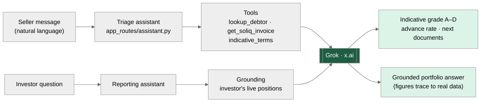
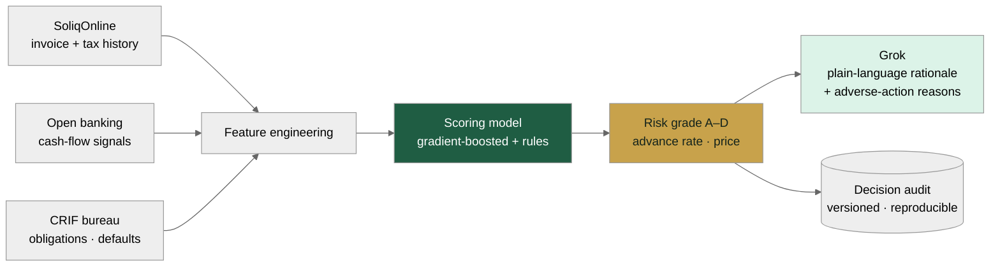
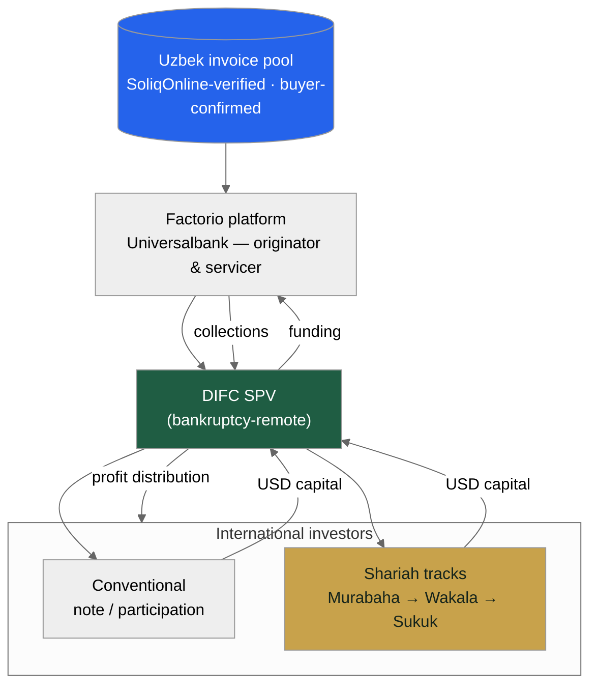
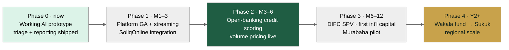

# Factorio for Universalbank
## AI-native invoice financing · an international-investor SPV · UAE entry

Prepared by Consistente Ltd · Tallinn · info@consistente.tech · consistente.tech

A proposal by **Consistente Ltd** to build and operate a next-generation, white-label invoice-financing platform for Universalbank — more efficient than the incumbent, priced on volume alone, with an AI core, an international-investor SPV, and a route into the UAE.

---

Executive summary

## Three moves, one platform

- **1 · A better platform.** Rebuild the OzPlanet-style bank factoring experience with an AI core, open-banking-style credit scoring, and a cleaner trilingual UX — priced on **financed volume only**, with no SaaS licence.
- **2 · International capital.** Add an SPV module so global — and specifically Gulf — investors can fund Uzbek receivables, turning a domestic product into a cross-border one.
- **3 · UAE entry.** Stand up a **DIFC SPV** and a phased Shariah programme (Murabaha → Wakala → Sukuk) to reach Dubai / DIFC Islamic capital.
- A working AI prototype ships **today** — chat-based loan triage and chat-based investor reporting are already live in the app.

---

The opportunity

## Uzbekistan built the perfect rails for invoice finance

- **SoliqOnline** — the State Tax Committee's platform — has validated, timestamped and archived every B2B e-invoice in the country since **January 2020**.
- **Didox** connects **350,000+ organisations** to it and integrates with 1C — a ready-made supplier base that already exchanges invoices electronically.
- Every invoice is government-verified and buyer-confirmed on official record — **fraud and debtor-confirmation, factoring's hardest problems, are solved at source.**
- The market is **~$2bn** addressable and **under 2.5% penetrated** — early, and growing fast.

---

Why now

## The regulatory window is open

- **Presidential Decree No. 106 (Aug 2024)** mandated banks to offer factoring.
- **ZRU-1058 (Apr 2025)** amended the Civil Code to give factoring full legal force, and mandates automated API registration of the bank's collateral priority in the **CBU registry** — within about an hour of approval.
- **No new licence** is required: Universalbank's existing CBU licence covers this; Factorio operates as white-label technology under the bank's umbrella.
- **No Uzbek bank has yet built a production-grade SoliqOnline factoring stack with an AI core** — the first mover captures structural advantage.

---

The incumbent

## OzPlanet set the market — and left it beatable

| Dimension | OzPlanet (incumbent) | Factorio by Consistente |
| --- | --- | --- |
| Commercial model | Bank SaaS licence / subscription | White-label, **volume-only** pricing — paid when the bank finances |
| Credit scoring | Bank's own manual / internal review | **Open-banking-style** automated score (SoliqOnline + bank txn + CRIF) |
| AI | — | **Chat triage + chat reporting (Grok)**, document intelligence |
| Onboarding UX | Bank-led, form-heavy | Self-serve, trilingual, minutes |
| International capital | Domestic banks only | **DIFC SPV** for global / Gulf investors |
| Time to indicative decision | Days | **Seconds** (indicative) · hours (final) |

> OzPlanet reportedly carries ~52% of factoring routed through e-platforms and serves ~50% of banks — proof the demand is real, and that a sharper product wins share.

---

Pillar 1 · A better platform

## AI at the core, not bolted on

- The same end-to-end factoring workflow — submit, verify, fund, settle — but with AI woven through triage, scoring, documents and reporting.
- Built on a lean, server-rendered stack (FastHTML + PostgreSQL) — fast to change, cheap to run, easy to white-label under the bank's brand.
- Trilingual by design (English · Oʻzbekcha · Russian); the AI answers in the user's language.
- The next three slides detail the AI, the credit-scoring engine, and the commercial model.

---

Pillar 1 · AI

## Two conversational surfaces, one Grok core

*Chat-based loan triage and chat-based investor reporting*

- **Triage** turns a seller's plain-language description into an indicative grade, advance rate and document list — in seconds.
- **Reporting** answers an investor's questions grounded in their own live positions — no invented figures.
- Grok scores and explains; a human always approves. Every AI decision is logged and auditable.

---

Pillar 1 · Credit scoring

## Open-banking-style scoring, Uzbek edition

*Plaid-style data fusion adapted to Uzbekistan's rails*

- The Plaid model is *connect an account, read the cash flows, decide*. In Uzbekistan the richest feed is **SoliqOnline** — verified invoices and tax-declared turnover — plus **bank transaction data** and the **CRIF** bureau.
- A model produces the **grade, advance rate and price**; Grok writes the **plain-language rationale and adverse-action reasons**.
- Every decision is **versioned and reproducible** — Consistente's core methodology, and what a regulator will ask for.

---

Pillar 1 · Commercial model

## Volume-only pricing — aligned with the bank

| Monthly financed volume | Platform fee (bps of financed volume) |
| --- | --- |
| Up to UZS 50 bn | 120 bps |
| UZS 50–200 bn | 90 bps |
| UZS 200–500 bn | 70 bps |
| Over UZS 500 bn | 55 bps |

> Illustrative. No SaaS licence, no per-seat, no setup fee — Consistente is paid only when the bank finances an invoice. International SPV module: ~60 bps p.a. on invested AUM + a performance share above an agreed hurdle. Final figures to be set with Universalbank.

---

Pillar 2 · International capital

## An SPV that opens Uzbek receivables to the world

*Invoice pool → Factorio → DIFC SPV → international investors*

- Universalbank remains **originator and servicer**; a bankruptcy-remote **SPV** holds the investor-facing interest and channels foreign capital into the invoice pool.
- Two tracks off the **same asset base**: a **conventional** note/participation for institutional investors, and **Shariah** structures for Gulf capital.
- Investors get the same grounded, AI-assisted reporting — in their language — plus statements and a clean audit trail.

---

Pillar 3 · UAE entry

## A phased Shariah programme for DIFC capital

| Criterion | Murabaha SCF | Wakala Fund | Sukuk | Musharaka |
| --- | --- | --- | --- | --- |
| Shariah purity | High | High | High | Highest |
| Complexity | Low | Low–Med | High | Medium |
| Time to market | Fastest | Fast | Slowest | Medium |
| Dubai investor appeal | Medium | High | Very high | High |
| Capital per deal | Small–Med | Medium | Large | Med–Large |
| Regulatory need | Fatwa only | Fatwa + fund | Fatwa + DFSA | Fatwa + fund |
| Best for | Pilot | Family offices | Institutional | Strategic partners |

> Recommended path: run them in sequence — Murabaha SCF pilot (M6–12) → Wakala fund → Sukuk. Each phase builds the track record that makes the next credible. All require an AAOIFI-accredited fatwa before deployment.

---

Pillar 3 · Why Dubai / DIFC

## The yield spread is the story

- Uzbek factoring yields of **~20–30% p.a.** against Gulf Islamic money-market returns of **~4–6%** — an exceptional spread for the risk, given SoliqOnline's structural protections.
- **Short duration** (30–90-day rolling receivables) is rare and highly demanded by Gulf liquidity managers.
- Uzbek receivables are **uncorrelated** with Gulf real estate, regional equities or oil — genuine diversification.
- **DIFC (DFSA)** and **ADGM (FSRA)** both have mature Islamic-finance frameworks and recognise SPV/Sukuk structures; the UAE's Federal Decree-Law No. 50 of 2022 codifies the contracts.

---

Architecture

## One process, AI-native, integration-ready

*Target system architecture with AI components highlighted*

- A single FastHTML process serves the landing site, the investor app and the AI assistants; PostgreSQL holds the factoring and AI data.
- Clean integration seams to **SoliqOnline/Didox**, **open banking**, **CRIF**, the **CBU registry**, and the **DIFC SPV / custodian**.
- Grok (x.ai) is reached over an OpenAI-compatible interface — the model id is configuration, avoiding vendor lock-in.

---

Proof · Working today

## The AI is not a slide — it's shipped

Live chat-based invoice triage in the Factorio app

- A seller describes an invoice in a sentence; the assistant returns an indicative risk band, advance rate and next-document list.
- Built on Grok (x.ai), trilingual, with graceful fallback and full audit logging — the same pattern extends to scoring and reporting.

---

Delivery

## From prototype to regional platform

*Phased rollout — each phase funds the next*

- **Phase 0 (now):** AI triage + reporting prototype live.
- **Phases 1–2 (M1–6):** platform GA, SoliqOnline integration, open-banking scoring, volume pricing.
- **Phases 3–4 (M6+):** DIFC SPV and first international capital, then the Wakala → Sukuk sequence and regional scale.

---

Why Consistente

## Production AI, delivered consistently

- Consistente Ltd (Tallinn, EU) builds **production-grade AI for enterprises** — with reproducible pipelines, versioned models and inspectable prompts, not black boxes.
- Precedents across **financial services and regulated sectors**: LSEG, DBRS Morningstar, ARM, Microsoft.
- Core capabilities map directly onto this project: **document intelligence**, **applied forecasting/scoring**, and **agentic workflows** with human review.
- EU-based, audit-first — the right profile for a bank building AI a regulator will scrutinise.

---

Next steps

## What we propose to do first

- **1.** Agree the white-label scope and the volume-based commercial terms.
- **2.** Stand up a pilot on live SoliqOnline data; ship the platform GA with the AI triage and scoring engine.
- **3.** In parallel, begin DIFC SPV and fatwa preparation so international capital can follow the operating book.
- **Contact:** Consistente Ltd · info@consistente.tech · consistente.tech
