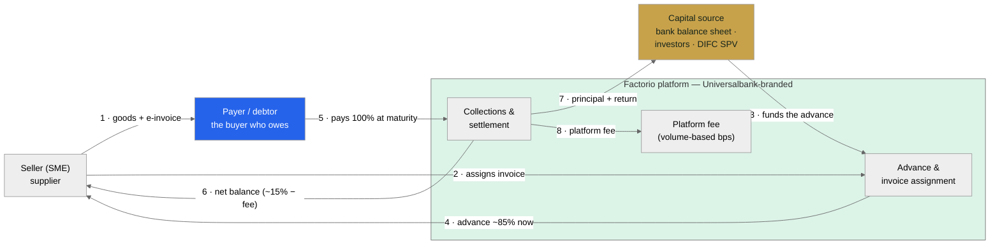
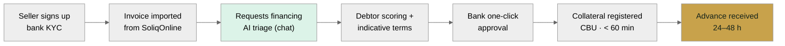
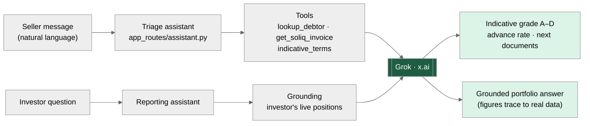
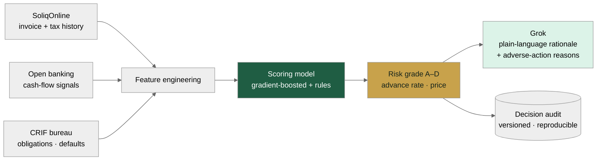
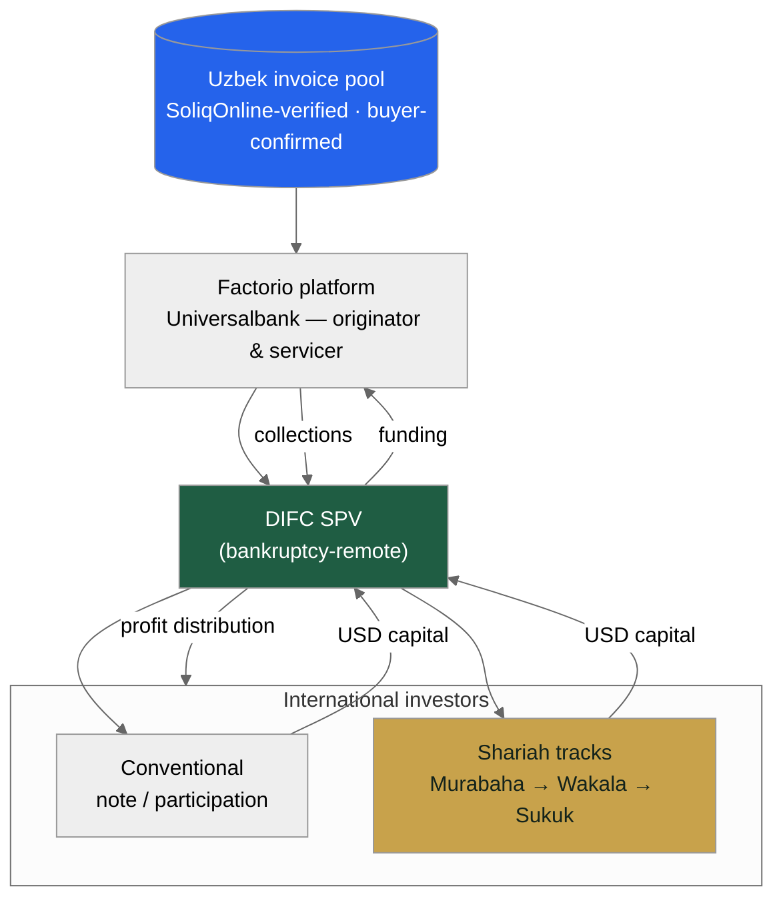
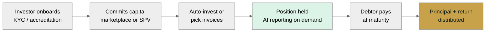
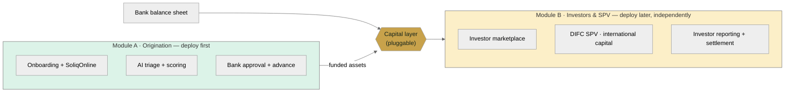
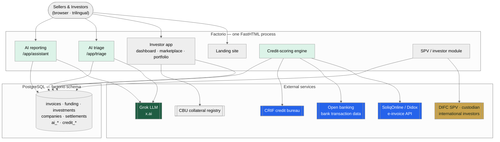
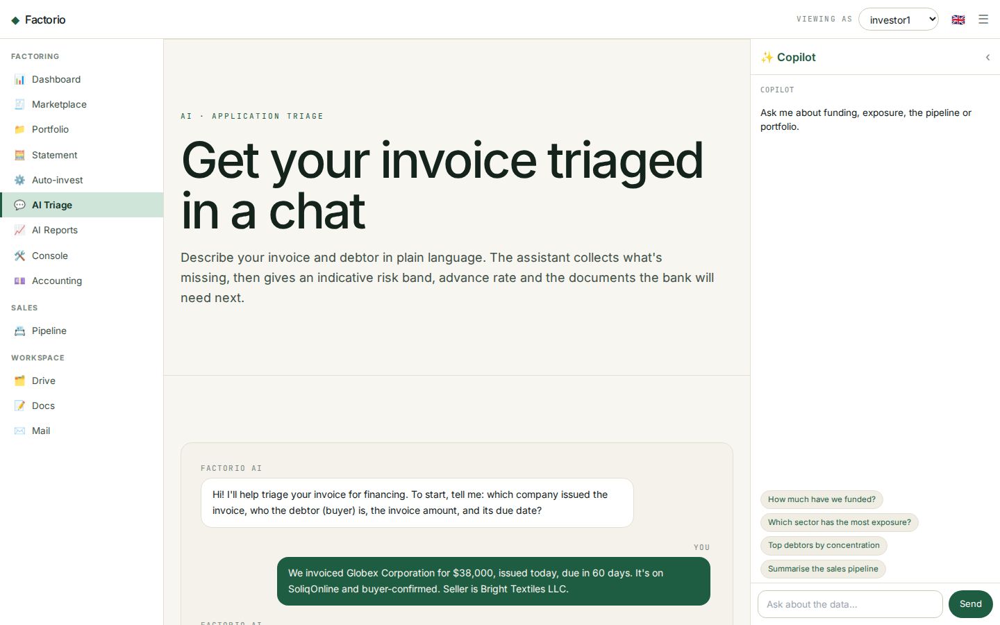
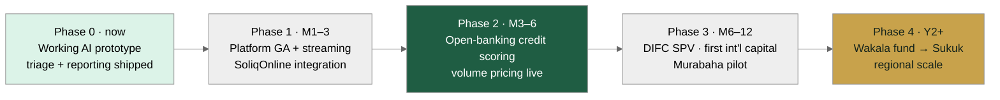

# Factorio for Universalbank
## AI-native invoice financing · an international-investor SPV · UAE entry

Prepared by Consistente Ltd · Tallinn · info@consistente.tech · consistente.tech

A proposal by **Consistente Ltd** to build and operate a next-generation, white-label invoice-financing platform for Universalbank — more efficient than the incumbent, priced on volume alone, with an AI core, an international-investor SPV, and a route into the UAE.

---

Executive summary

## Three moves, one platform

- **The gap.** Every Uzbek bank *rents* its factoring product from OzPlanet or FinMakon — Universalbank included (OzPlanet cooperation agreement, Sept 2024). None *owns* the product, the customer relationship or the data.
- **1 · Own the platform.** A white-label, AI-native platform Universalbank runs under its own brand — the bank owns the product, customers and data — priced on **financed volume only**.
- **2 · International capital.** An SPV module lets global — and specifically Gulf — investors fund Uzbek receivables. OzPlanet and FinMakon take **no foreign or retail money**, so this is a clean, uncontested differentiator.
- **3 · UAE entry.** A **DIFC SPV** and a phased Shariah programme (Murabaha → Wakala → Sukuk) to reach Dubai / DIFC Islamic capital.
- **Decomposable & live today.** Deploy origination first, add the investor / SPV layer later — and the chat-based loan triage and investor reporting are **already running** in the app.

---

The opportunity

## Uzbekistan built the perfect rails for invoice finance

- **SoliqOnline** — the State Tax Committee's platform — has validated, timestamped and archived every B2B e-invoice in the country since **January 2020**.
- **Didox** connects **350,000+ organisations** to it and integrates with 1C — a ready-made supplier base that already exchanges invoices electronically.
- Every invoice is government-verified and buyer-confirmed on official record — **fraud and debtor-confirmation, factoring's hardest problems, are solved at source.**
- The market is scaling fast: the **CBU reports ~10.6 trillion soums (~$835M) factored in Jan–Sep 2025**, about **half of it digital** — against a **~$2bn** addressable market that is still lightly penetrated.

---

Why now

## The regulatory window is open

- **Presidential Decree No. 106 (Aug 2024)** mandated banks to offer factoring.
- **ZRU-1058 (Apr 2025)** amended the Civil Code to give factoring full legal force, and mandates automated API registration of the bank's collateral priority in the **CBU registry** — within about an hour of approval.
- **No new licence** is required: Universalbank's existing CBU licence covers this; Factorio operates as white-label technology under the bank's umbrella.
- **No Uzbek bank has yet built a production-grade SoliqOnline factoring stack with an AI core** — the first mover captures structural advantage.

---

The incumbents

## OzPlanet & FinMakon own the market — as aggregators

| Dimension | OzPlanet | FinMakon | Factorio (Consistente) |
| --- | --- | --- | --- |
| Model | Aggregator; bank-set rates | Aggregator (Didox-backed) | **White-label marketplace** — bank owns it |
| Digital share (Q3 2025) | 56% of digital volume | 44% of digital volume | New entrant — builds share |
| Funding sources | Banks / MFOs only | Banks / factoring cos | **Banks + investors + retail + SPV** |
| Foreign / retail capital | **No** | **No** | **Yes** — SPV + marketplace |
| Bank owns product & data | No — OzPlanet does | No — FinMakon does | **Yes** — fully the bank's |
| AI core | Rule-based; nascent | Nascent | **Grok chat triage + reporting**, doc intelligence |
| Pricing to bank | Per-transaction commission | Per-transaction commission | **Volume-only bps** (no SaaS licence) |

> Universalbank already signed a cooperation agreement with OzPlanet (Sept 2024) — so it knows the model. The point of this proposal is not to rent a better aggregator, but to own the product outright. (Market data: CBU, Q3 2025.)

---

The strategic gap

## No Uzbek bank owns its factoring product

- Today a bank connecting to OzPlanet or FinMakon is a **funding partner on someone else's platform** — the aggregator owns the brand, the customer relationship and the data.
- That is a strategic dependency: the bank cannot differentiate, cannot cross-sell off its own data, and cannot switch without losing the clients.
- **Factorio flips this.** Universalbank runs the platform under its **own brand**, owns **all customer and transaction data**, and can export and move it — no platform lock-in.
- Same government rails (SoliqOnline, CBU registry), same speed — but the bank owns the asset instead of renting the rails. That ownership is the real product.

---

How it works

## How the money moves — and who gets paid

*Money & payment flow — seller, payer (debtor), platform, capital*

- The **payer (debtor)** is the anchor: a specific, buyer-confirmed obligation on the SoliqOnline record.
- The platform advances ~85% now from the **capital source** (bank, investor or SPV); at maturity the payer settles 100% and the waterfall pays seller, capital and platform.
- Because the flow is identical regardless of who funds it, the **capital layer is pluggable** — bank first, investors/SPV later.

---

Pillar 1 · A better platform

## AI at the core, not bolted on

- The same end-to-end factoring workflow — submit, verify, fund, settle — but with AI woven through triage, scoring, documents and reporting.
- Built on a lean, server-rendered stack (FastHTML + PostgreSQL) — fast to change, cheap to run, easy to white-label under the bank's brand.
- Trilingual by design (English · Oʻzbekcha · Russian); the AI answers in the user's language.
- The next three slides detail the AI, the credit-scoring engine, and the commercial model.

---

Journey · Borrower (origination)

## The seller's journey — sign-up to cash in 24–48h

*Origination: SoliqOnline import → AI triage → one-click approval → advance*

- Manual bank involvement is a **single approval click** on a pre-populated screen; everything else is automated.
- The invoice is imported and verified from SoliqOnline; the debtor is scored; collateral is registered with the CBU in **under 60 minutes**.
- This is **Module A** — it stands alone and can go live first, funded entirely by the bank's balance sheet.

---

Pillar 1 · AI

## Two conversational surfaces, one Grok core

*Chat-based loan triage and chat-based investor reporting*

- **Triage** turns a seller's plain-language description into an indicative grade, advance rate and document list — in seconds.
- **Reporting** answers an investor's questions grounded in their own live positions — no invented figures.
- Grok scores and explains; a human always approves. Every AI decision is logged and auditable.

---

Pillar 1 · Credit scoring

## Open-banking-style scoring, Uzbek edition

*Plaid-style data fusion adapted to Uzbekistan's rails*

- The Plaid model is *connect an account, read the cash flows, decide*. In Uzbekistan the richest feed is **SoliqOnline** — verified invoices and tax-declared turnover — plus **bank transaction data** and the **CRIF** bureau.
- A model produces the **grade, advance rate and price**; Grok writes the **plain-language rationale and adverse-action reasons**.
- Every decision is **versioned and reproducible** — Consistente's core methodology, and what a regulator will ask for.

---

Economics

## What the bank earns on one invoice

| Cash flow · $10,000 invoice · 85% · 60d · 5% | Amount | Direction | Day |
| --- | --- | --- | --- |
| Advance to seller (85%) | $8,500 | Platform → seller | Day 1 |
| Payer (debtor) pays in full | $10,000 | Payer → collection | Day 60 |
| Net balance released to seller | $1,500 | Platform → seller | Day 60 |
| Discount income (gross) | $500 | Capital keeps | Day 60 |
| Platform fee (volume-based) | ≈ $13 | Bank → Consistente | Day 60 |
| **Net income on the invoice** | **≈ $487** | **Capital keeps** | **Day 60** |
| **Annualised return on capital** | **≈ 30% p.a.** | — | — |

> Illustrative, per the standard SoliqOnline-verified structure. ~30% annualised on deployed capital compares with 22–28% on unsecured SME lending — at lower risk: the invoice is government-verified, the payer has confirmed the obligation, and the bank holds a registered CBU priority claim. Bank stays profitable to a ~4% default rate.

---

Pillar 1 · Commercial model

## Volume-only pricing — aligned with the bank

| Monthly financed volume | Platform fee (bps of financed volume) |
| --- | --- |
| Up to UZS 50 bn | 120 bps |
| UZS 50–200 bn | 90 bps |
| UZS 200–500 bn | 70 bps |
| Over UZS 500 bn | 55 bps |

> Illustrative. No SaaS licence, no per-seat, no setup fee — Consistente is paid only when the bank finances an invoice. Options on the table: a revenue-share alternative (a small % of the bank's discount income instead of bps), 12-month bank exclusivity in Uzbekistan, and a Year-3 deferred-equity option structured as new shares (non-dilutive, no board/veto rights). International SPV module: ~60 bps p.a. on invested AUM + a performance share above a hurdle. Final figures to be set with Universalbank.

---

Pillar 2 · International capital

## An SPV that opens Uzbek receivables to the world

*Invoice pool → Factorio → DIFC SPV → international investors*

- Universalbank remains **originator and servicer**; a bankruptcy-remote **SPV** holds the investor-facing interest and channels foreign capital into the invoice pool.
- Two tracks off the **same asset base**: a **conventional** note/participation for institutional investors, and **Shariah** structures for Gulf capital.
- Investors get the same grounded, AI-assisted reporting — in their language — plus statements and a clean audit trail.

---

Journey · Investor

## The investor's journey — onboarding to distribution

*Investor: onboard → commit capital → hold with AI reporting → get paid*

- Retail, institutional and Gulf investors onboard once (KYC / accreditation), then fund via the **marketplace** or the **SPV**.
- They hold positions with **on-demand AI portfolio reporting**; at maturity, principal + return are distributed automatically.
- This is **Module B** — it plugs onto the same origination engine later, without changing anything a seller or the bank does.

---

Delivery · Decomposability

## Two modules — buy one, or both, in sequence

*Origination (Module A) and Investors/SPV (Module B) are independently deployable*

- **Module A — Origination** can be Universalbank's whole first phase: bank-funded factoring, live in weeks, immediately satisfying the Decree-106 mandate.
- **Module B — Investors & SPV** adds the marketplace and DIFC/international capital later, over the same engine, with no rework.
- The **capital layer is the seam**: swap or add funding sources without touching origination — de-risking the programme and the investment.

---

Pillar 3 · UAE entry

## A phased Shariah programme for DIFC capital

| Criterion | Murabaha SCF | Wakala Fund | Sukuk | Musharaka |
| --- | --- | --- | --- | --- |
| Shariah purity | High | High | High | Highest |
| Complexity | Low | Low–Med | High | Medium |
| Time to market | Fastest | Fast | Slowest | Medium |
| Dubai investor appeal | Medium | High | Very high | High |
| Capital per deal | Small–Med | Medium | Large | Med–Large |
| Regulatory need | Fatwa only | Fatwa + fund | Fatwa + DFSA | Fatwa + fund |
| Best for | Pilot | Family offices | Institutional | Strategic partners |

> Recommended path: run them in sequence — Murabaha SCF pilot (M6–12) → Wakala fund → Sukuk. Each phase builds the track record that makes the next credible. All require an AAOIFI-accredited fatwa before deployment.

---

Pillar 3 · Why Dubai / DIFC

## The yield spread is the story

- Uzbek factoring yields of **~20–30% p.a.** against Gulf Islamic money-market returns of **~4–6%** — an exceptional spread for the risk, given SoliqOnline's structural protections.
- **Short duration** (30–90-day rolling receivables) is rare and highly demanded by Gulf liquidity managers.
- Uzbek receivables are **uncorrelated** with Gulf real estate, regional equities or oil — genuine diversification.
- **DIFC (DFSA)** and **ADGM (FSRA)** both have mature Islamic-finance frameworks and recognise SPV/Sukuk structures; the UAE's Federal Decree-Law No. 50 of 2022 codifies the contracts.

---

Architecture

## One process, AI-native, integration-ready

*Target system architecture with AI components highlighted*

- A single FastHTML process serves the landing site, the investor app and the AI assistants; PostgreSQL holds the factoring and AI data.
- Clean integration seams to **SoliqOnline/Didox**, **open banking**, **CRIF**, the **CBU registry**, and the **DIFC SPV / custodian**.
- Grok (x.ai) is reached over an OpenAI-compatible interface — the model id is configuration, avoiding vendor lock-in.

---

Proof · Working today

## The AI is not a slide — it's shipped

Live chat-based invoice triage in the Factorio app

- A seller describes an invoice in a sentence; the assistant returns an indicative risk band, advance rate and next-document list.
- Built on Grok (x.ai), trilingual, with graceful fallback and full audit logging — the same pattern extends to scoring and reporting.

---

Delivery

## From prototype to regional platform

*Phased rollout — each phase funds the next*

- **Phase 0 (now):** AI triage + reporting prototype live.
- **Phases 1–2 (M1–6):** platform GA, SoliqOnline integration, open-banking scoring, volume pricing.
- **Phases 3–4 (M6+):** DIFC SPV and first international capital, then the Wakala → Sukuk sequence and regional scale.

---

Why Consistente

## Production AI, delivered consistently

- Consistente Ltd (Tallinn, EU) builds **production-grade AI for enterprises** — with reproducible pipelines, versioned models and inspectable prompts, not black boxes.
- Precedents across **financial services and regulated sectors**: LSEG, DBRS Morningstar, ARM, Microsoft.
- Core capabilities map directly onto this project: **document intelligence**, **applied forecasting/scoring**, and **agentic workflows** with human review.
- EU-based, audit-first — the right profile for a bank building AI a regulator will scrutinise.

---

Next steps

## What we propose to do first

- **1.** Agree the white-label scope and the volume-based commercial terms.
- **2.** Stand up a pilot on live SoliqOnline data; ship the platform GA with the AI triage and scoring engine.
- **3.** In parallel, begin DIFC SPV and fatwa preparation so international capital can follow the operating book.
- **Contact:** Consistente Ltd · info@consistente.tech · consistente.tech
