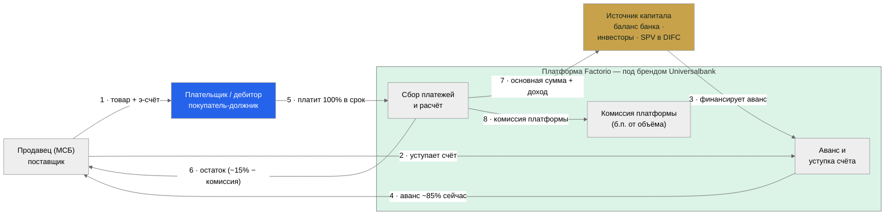
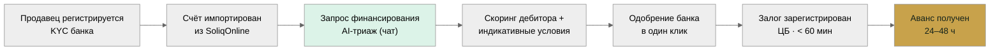
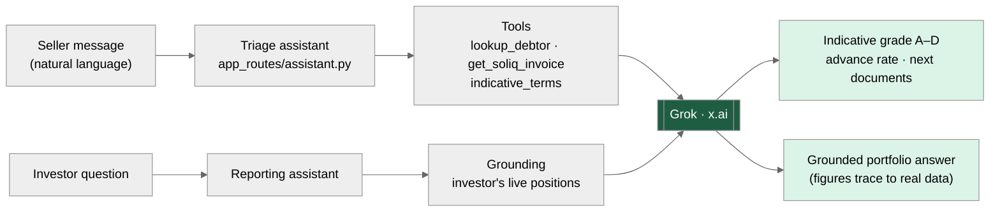
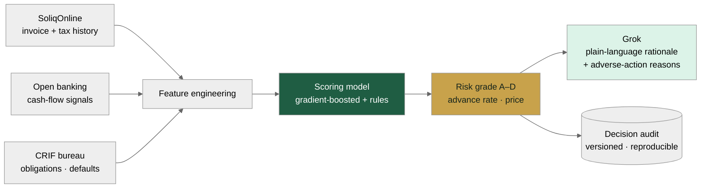
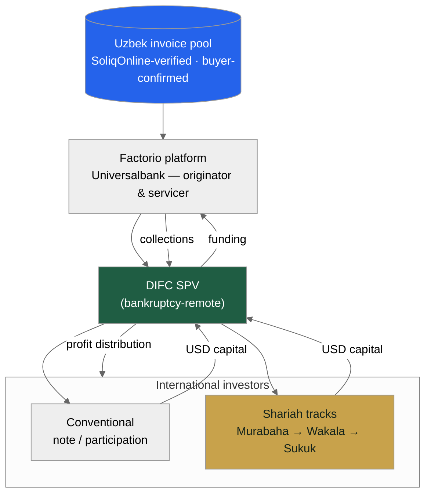
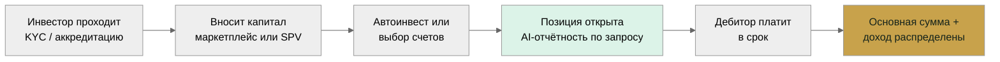
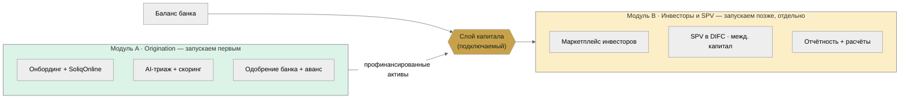
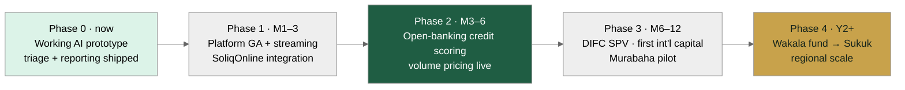

# Factorio для Universalbank
## Факторинг на базе ИИ · SPV для международных инвесторов · выход в ОАЭ

Подготовлено Consistente Ltd · Таллин · info@consistente.tech · consistente.tech

Предложение от **Consistente Ltd** построить и эксплуатировать для Universalbank платформу факторинга нового поколения (white-label) — эффективнее действующего решения, с оплатой только за объём, с ИИ-ядром, SPV для международных инвесторов и выходом в ОАЭ.

---

Краткое резюме

## Три шага, одна платформа

- **Разрыв.** Каждый узбекский банк *арендует* факторинговый продукт у OzPlanet или FinMakon — включая Universalbank (соглашение с OzPlanet, сент. 2024). Никто не *владеет* продуктом, отношениями с клиентом и данными.
- **1 · Владеть платформой.** White-label ИИ-платформа, которую Universalbank ведёт под своим брендом — банк владеет продуктом, клиентами и данными — с оплатой **только за профинансированный объём**.
- **2 · Международный капитал.** Модуль SPV позволяет глобальным — и прежде всего инвесторам Залива — финансировать узбекскую дебиторку. OzPlanet и FinMakon **не принимают иностранные или розничные деньги**, поэтому это чистый, незанятый дифференциатор.
- **3 · Выход в ОАЭ.** **SPV в DIFC** и поэтапная исламская программа (Мурабаха → Вакала → Сукук) для доступа к исламскому капиталу Дубая / DIFC.
- **Декомпозируемо и уже работает.** Сначала запускаем origination, слой инвесторов / SPV добавляем позже — а триаж заявок и отчётность в чате **уже работают** в приложении.

---

Возможность

## Узбекистан построил идеальную инфраструктуру для факторинга

- **SoliqOnline** — платформа Государственного налогового комитета — с **января 2020 года** проверяет, фиксирует по времени и архивирует каждую B2B-электронную счёт-фактуру в стране.
- **Didox** подключает к ней **350 000+ организаций** и интегрируется с 1С — готовая база поставщиков, уже обменивающихся счетами в электронном виде.
- Каждый счёт проверен государством и подтверждён покупателем в официальном реестре — **мошенничество и подтверждение дебитора, самые сложные проблемы факторинга, решены у источника.**
- Рынок быстро растёт: **ЦБ сообщает о ~10,6 трлн сум (~$835 млн) факторинга за янв–сен 2025**, около **половины — цифровой**, при адресном рынке **~$2 млрд** с всё ещё низким проникновением.

---

Почему сейчас

## Регуляторное окно открыто

- **Указ Президента № 106 (авг. 2024)** обязал банки предоставлять факторинг.
- **ЗРУ-1058 (апр. 2025)** внёс поправки в Гражданский кодекс, придав факторингу полную юридическую силу, и обязал автоматически регистрировать залоговый приоритет банка в **реестре ЦБ РУз** по API — примерно в течение часа после одобрения.
- **Новая лицензия не требуется:** действующая лицензия ЦБ у Universalbank это покрывает; Factorio работает как white-label-технология под эгидой банка.
- **Ни один узбекский банк ещё не построил промышленный факторинговый стек на SoliqOnline с ИИ-ядром** — первопроходец получает структурное преимущество.

---

Действующие игроки

## OzPlanet и FinMakon владеют рынком — как агрегаторы

| Параметр | OzPlanet | FinMakon | Factorio (Consistente) |
| --- | --- | --- | --- |
| Модель | Агрегатор; ставки банка | Агрегатор (при Didox) | **White-label маркетплейс** — владеет банк |
| Доля в цифре (Q3 2025) | 56% цифрового объёма | 44% цифрового объёма | Новичок — набирает долю |
| Источники капитала | Только банки / МФО | Банки / факторинг-компании | **Банки + инвесторы + розница + SPV** |
| Иностр. / розн. капитал | **Нет** | **Нет** | **Да** — SPV + маркетплейс |
| Банк владеет продуктом и данными | Нет — владеет OzPlanet | Нет — владеет FinMakon | **Да** — полностью банка |
| ИИ-ядро | Правила; зачаточно | Зачаточно | **Grok: триаж + отчётность**, обработка документов |
| Цена для банка | Комиссия за транзакцию | Комиссия за транзакцию | **Только б.п. от объёма** (без SaaS) |

> Universalbank уже подписал соглашение о сотрудничестве с OzPlanet (сент. 2024) — то есть знает модель. Смысл этого предложения — не арендовать более удобный агрегатор, а владеть продуктом полностью. (Данные рынка: ЦБ, Q3 2025.)

---

Стратегический разрыв

## Ни один узбекский банк не владеет своим факторингом

- Сегодня банк, подключённый к OzPlanet или FinMakon, — это **партнёр по финансированию на чужой платформе**: агрегатор владеет брендом, отношениями с клиентом и данными.
- Это стратегическая зависимость: банк не может дифференцироваться, не может продавать по своим данным и не может сменить поставщика, не потеряв клиентов.
- **Factorio это переворачивает.** Universalbank ведёт платформу под **своим брендом**, владеет **всеми клиентскими и транзакционными данными** и может их выгрузить и перенести — без привязки к платформе.
- Та же гос. инфраструктура (SoliqOnline, реестр ЦБ), та же скорость — но банк владеет активом, а не арендует рельсы. Именно это владение и есть продукт.

---

Как это работает

## Как движутся деньги — и кто получает оплату

*Поток денег и платежей — продавец, плательщик (дебитор), платформа, капитал*

- **Плательщик (дебитор)** — якорь: конкретное, подтверждённое покупателем обязательство в реестре SoliqOnline.
- Платформа выдаёт ~85% сразу из **источника капитала** (банк, инвестор или SPV); в срок плательщик гасит 100%, и водопад платит продавцу, капиталу и платформе.
- Поскольку поток одинаков независимо от источника финансирования, **слой капитала подключаемый** — сначала банк, инвесторы/SPV позже.

---

Направление 1 · Лучшая платформа

## ИИ в основе, а не сбоку

- Тот же сквозной процесс факторинга — подача, проверка, финансирование, расчёт — но с ИИ в триаже, скоринге, документах и отчётности.
- На лёгком серверном стеке (FastHTML + PostgreSQL) — быстро менять, дёшево эксплуатировать, легко брендировать под банк.
- Трёхъязычность заложена в дизайн (английский · узбекский · русский); ИИ отвечает на языке пользователя.
- Следующие три слайда раскрывают ИИ, движок кредитного скоринга и коммерческую модель.

---

Путь · Заёмщик (origination)

## Путь продавца — от регистрации до денег за 24–48 ч

*Origination: импорт из SoliqOnline → AI-триаж → одобрение в один клик → аванс*

- Ручное участие банка — **один клик одобрения** на заранее заполненном экране; всё остальное автоматизировано.
- Счёт импортируется и проверяется из SoliqOnline; дебитор скорится; залог регистрируется в ЦБ **менее чем за 60 минут**.
- Это **Модуль A** — он самодостаточен и может быть запущен первым, полностью за счёт баланса банка.

---

Направление 1 · ИИ

## Две разговорные поверхности, одно ядро Grok

*Триаж заявок в чате и отчётность для инвесторов в чате*

- **Триаж** превращает описание продавца на естественном языке в индикативный рейтинг, ставку аванса и список документов — за секунды.
- **Отчётность** отвечает на вопросы инвестора на основе его реальных позиций — без выдуманных цифр.
- Grok оценивает и объясняет; финальное решение всегда за человеком. Каждое решение ИИ логируется и проверяемо.

---

Направление 1 · Кредитный скоринг

## Скоринг в духе open banking, узбекская версия

*Слияние данных в стиле Plaid, адаптированное к инфраструктуре Узбекистана*

- Модель Plaid — это *подключи счёт, прочитай денежные потоки, прими решение*. В Узбекистане богатейший источник — **SoliqOnline** (проверенные счета и налоговый оборот) плюс **банковские транзакции** и бюро **CRIF**.
- Модель выдаёт **рейтинг, ставку аванса и цену**; Grok формирует **понятное обоснование и причины отказа**.
- Каждое решение **версионируется и воспроизводимо** — ключевая методология Consistente и то, что запросит регулятор.

---

Экономика

## Что банк зарабатывает на одном счёте

| Поток · счёт $10 000 · 85% · 60 дн · 5% | Сумма | Направление | День |
| --- | --- | --- | --- |
| Аванс продавцу (85%) | $8 500 | Платформа → продавец | День 1 |
| Плательщик (дебитор) платит полностью | $10 000 | Плательщик → сбор | День 60 |
| Остаток продавцу | $1 500 | Платформа → продавец | День 60 |
| Дисконтный доход (брутто) | $500 | Капитал удерживает | День 60 |
| Комиссия платформы (за объём) | ≈ $13 | Банк → Consistente | День 60 |
| **Чистый доход по счёту** | **≈ $487** | **Капитал удерживает** | **День 60** |
| **Годовая доходность на капитал** | **≈ 30% год.** | — | — |

> Иллюстративно, по стандартной структуре с проверкой SoliqOnline. ~30% годовых на размещённый капитал против 22–28% по необеспеченному кредитованию МСБ — при меньшем риске: счёт проверен государством, плательщик подтвердил обязательство, банк держит зарегистрированный приоритет в ЦБ. Банк прибылен вплоть до ~4% дефолтов.

---

Направление 1 · Коммерческая модель

## Оплата только за объём — интересы совпадают с банком

| Месячный объём финансирования | Комиссия платформы (б.п. от объёма) |
| --- | --- |
| До 50 млрд сум | 120 б.п. |
| 50–200 млрд сум | 90 б.п. |
| 200–500 млрд сум | 70 б.п. |
| Свыше 500 млрд сум | 55 б.п. |

> Иллюстративно. Без SaaS-лицензии, без оплаты за место, без платы за внедрение — Consistente получает вознаграждение только когда банк финансирует счёт. Опции на столе: альтернатива с revenue-share (небольшой % дисконтного дохода банка вместо б.п.), 12-месячная эксклюзивность для банка в Узбекистане и отложенный опцион на долю в Год 3 в виде новых акций (без размытия, без прав в совете/вето). Модуль международного SPV: ~60 б.п. в год от инвестированных активов + доля от результата сверх порога. Итоговые цифры — по согласованию с Universalbank.

---

Направление 2 · Международный капитал

## SPV, открывающее узбекскую дебиторку миру

*Пул счетов → Factorio → SPV в DIFC → международные инвесторы*

- Universalbank остаётся **оригинатором и сервисером**; защищённое от банкротства **SPV** держит инвесторскую долю и направляет иностранный капитал в пул счетов.
- Два трека на **одной базе активов**: **конвенциональная** нота/участие для институционалов и **исламские** структуры для капитала Залива.
- Инвесторы получают ту же обоснованную ИИ-отчётность — на своём языке — плюс выписки и прозрачный аудиторский след.

---

Путь · Инвестор

## Путь инвестора — от онбординга до распределения

*Инвестор: онбординг → капитал → удержание с AI-отчётностью → выплата*

- Розничные, институциональные и инвесторы Залива проходят онбординг один раз (KYC / аккредитация), затем финансируют через **маркетплейс** или **SPV**.
- Они держат позиции с **AI-отчётностью по запросу**; в срок основная сумма и доход распределяются автоматически.
- Это **Модуль B** — он подключается к тому же движку origination позже, ничего не меняя для продавца или банка.

---

Реализация · Декомпозируемость

## Два модуля — берите один или оба, последовательно

*Origination (Модуль A) и Инвесторы/SPV (Модуль B) внедряются независимо*

- **Модуль A — Origination** может стать всей первой фазой Universalbank: факторинг за счёт банка, запуск за недели, немедленное выполнение требований Указа № 106.
- **Модуль B — Инвесторы и SPV** добавляет маркетплейс и капитал DIFC/международный позже, поверх того же движка, без переделок.
- **Слой капитала — это стык**: меняйте или добавляйте источники финансирования, не трогая origination — снижая риск программы и инвестиций.

---

Направление 3 · Выход в ОАЭ

## Поэтапная исламская программа для капитала DIFC

| Критерий | Мурабаха (SCF) | Фонд Вакала | Сукук | Мушарака |
| --- | --- | --- | --- | --- |
| Шариатская чистота | Высокая | Высокая | Высокая | Наивысшая |
| Сложность | Низкая | Низк.–ср. | Высокая | Средняя |
| Срок вывода | Самый быстрый | Быстро | Дольше всех | Средне |
| Привлекательность (Дубай) | Средняя | Высокая | Очень высокая | Высокая |
| Капитал на сделку | Мал.–ср. | Средний | Крупный | Ср.–крупн. |
| Регуляторика | Только фатва | Фатва + фонд | Фатва + DFSA | Фатва + фонд |
| Кому подходит | Пилот | Family office | Институционалы | Стратег. партнёры |

> Рекомендуемый путь: последовательно — пилот Мурабаха (M6–12) → фонд Вакала → Сукук. Каждый этап формирует историю, делающую следующий убедительным. Все требуют фатвы аккредитованного AAOIFI совета до запуска.

---

Направление 3 · Почему Дубай / DIFC

## Главное — спред доходности

- Доходность узбекского факторинга **~20–30% годовых** против исламского денежного рынка Залива **~4–6%** — исключительный спред для такого риска благодаря структурной защите SoliqOnline.
- **Короткая дюрация** (оборот 30–90 дней) редка и очень востребована у ликвидити-менеджеров Залива.
- Узбекская дебиторка **не коррелирует** с недвижимостью Залива, региональными акциями или нефтью — настоящая диверсификация.
- **DIFC (DFSA)** и **ADGM (FSRA)** имеют зрелые рамки исламских финансов и признают структуры SPV/Сукук; Федеральный декрет-закон № 50 от 2022 кодифицирует контракты.

---

Архитектура

## Один процесс, ИИ-нативный, готовый к интеграциям

*Целевая архитектура системы с выделенными ИИ-компонентами*

- Единый процесс FastHTML обслуживает лендинг, приложение инвестора и ИИ-ассистентов; PostgreSQL хранит данные факторинга и ИИ.
- Чистые точки интеграции с **SoliqOnline/Didox**, **open banking**, **CRIF**, **реестром ЦБ** и **SPV/кастодианом в DIFC**.
- Grok (x.ai) подключается через OpenAI-совместимый интерфейс — id модели задаётся конфигурацией, что исключает привязку к вендору.

---

Доказательство · Работает уже сегодня

## ИИ — не слайд, он уже внедрён

Действующий триаж счёта в чате в приложении Factorio

- Продавец описывает счёт одним предложением; ассистент возвращает индикативный рейтинг, ставку аванса и список документов.
- На базе Grok (x.ai), трёхъязычно, с корректным запасным поведением и полным аудитом — тот же подход расширяется на скоринг и отчётность.

---

Реализация

## От прототипа к региональной платформе

*Поэтапный запуск — каждый этап финансирует следующий*

- **Этап 0 (сейчас):** прототип ИИ-триажа и отчётности работает.
- **Этапы 1–2 (M1–6):** релиз платформы, интеграция SoliqOnline, скоринг на open banking, оплата за объём.
- **Этапы 3–4 (M6+):** SPV в DIFC и первый международный капитал, затем последовательность Вакала → Сукук и региональный масштаб.

---

Почему Consistente

## Промышленный ИИ, поставляемый стабильно

- Consistente Ltd (Таллин, ЕС) создаёт **промышленный ИИ для предприятий** — с воспроизводимыми пайплайнами, версионируемыми моделями и прозрачными промптами, а не «чёрные ящики».
- Опыт в **финансовых услугах и регулируемых секторах**: LSEG, DBRS Morningstar, ARM, Microsoft.
- Ключевые компетенции прямо ложатся на проект: **интеллектуальная обработка документов**, **прикладной прогноз/скоринг** и **агентные процессы** с проверкой человеком.
- Базируется в ЕС, приоритет аудируемости — верный профиль для банка, строящего ИИ под надзором регулятора.

---

Следующие шаги

## Что предлагаем сделать первым

- **1.** Согласовать объём white-label и коммерческие условия на основе объёма.
- **2.** Запустить пилот на реальных данных SoliqOnline; вывести платформу в релиз с ИИ-триажем и движком скоринга.
- **3.** Параллельно начать подготовку SPV в DIFC и фатвы, чтобы международный капитал последовал за операционным портфелем.
- **Контакт:** Consistente Ltd · info@consistente.tech · consistente.tech
